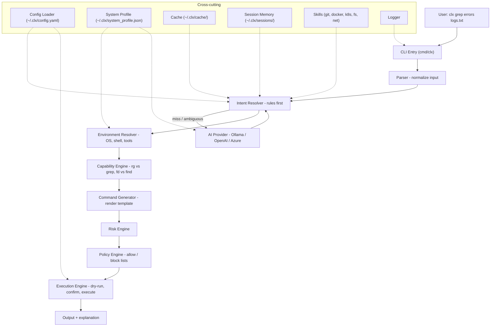

# CLX — V1 Architecture

> **Write commands once. Run anywhere.**

CLX is a lightweight, AI-assisted cross-platform command intelligence layer. It understands user intent, translates commands between environments, and executes them safely across Windows CMD, PowerShell, Bash, Zsh, Linux, macOS, Ubuntu, and WSL.

This document defines the target V1 architecture. Runtime state lives in `~/.clx/`; the repo contains the engine, rules, skills, and shipped defaults.

---

## 1. Design principles

| Principle | Meaning |
|-----------|---------|
| **Rules first** | Most requests resolve via deterministic YAML rules — no LLM call |
| **AI fallback** | LLM invoked only for ambiguous, natural-language, or broken inputs |
| **Safe by default** | Dry-run, confirmation, risk classification, and policy enforcement |
| **Explainable** | Every translation shows intent, native command, and risk level |
| **Cross-platform** | Single Go binary; environment-aware command generation |
| **Lightweight** | Fast startup, minimal dependencies, session-scoped memory only |

Runtime footprint budgets (binary size, cold start) are enforced in CI via [`scripts/check-budgets.sh`](../scripts/check-budgets.sh); run `make budgets` locally.

---

## 2. High-level pipeline



### Example flow

```
Input:  clx grep errors logs.txt
  ↓ Parser         → raw shell command detected
  ↓ Intent         → search_text_in_file { pattern: "errors", file: "logs.txt" }
  ↓ Environment    → { os: windows, shell: powershell, tools: [git, docker, node] }
  ↓ Capability     → Select-String preferred over findstr (PowerShell native)
  ↓ Generator      → Select-String "errors" logs.txt
  ↓ Risk           → { risk: low }
  ↓ Policy         → allowed
  ↓ Execution      → Execute? [Y/n]
```

---

## 3. Component contracts

Each component lives in `internal/<name>/` as a private Go package. Interfaces are defined per package; concrete implementations are wired in `cmd/clx`.

### 3.1 CLI Entry — `cmd/clx`, `cmd/clxmax`

**Responsibility:** Parse argv, load config, wire the pipeline, handle exit codes.

| Flag | Purpose |
|------|---------|
| `--explain` | Show intent + translation without executing |
| `--dry-run` | Preview command and affected resources |
| `--yes` / `-y` | Skip confirmation prompt |
| `--provider` | Override AI provider for this invocation |

**Subcommands:**

| Command | Purpose |
|---------|---------|
| `clx config show` | Display provider-related settings (secrets masked) |
| `clx config get <path>` | Read one setting (secrets masked) |
| `clx config set <path> [value]` | Persist a setting; secret paths prompt with hidden input |
| `clx config provider use <name>` | Set active provider |
| `clx config provider list` | List supported providers |
| `clx config encrypt-secrets` | Re-encrypt plaintext API keys on disk |
| `clx safety show` | Display active safety mode and per-risk behavior |
| `clx safety set mode=<low\|medium\|high\|custom>` | Set safety preset |
| `clx safety set require_confirmation=<bool>` | Custom toggle (switches mode to custom) |
| `clx safety set dry_run=<bool>` | Custom toggle (switches mode to custom) |
| `clx safety set explain=<bool>` | Custom toggle (switches mode to custom) |

See [doc/provider-config.md](provider-config.md) for paths, encryption, and security notes.

**Binaries:**

- **`clx`** — Fast, rules-first, single-shot translation/execution.
- **`clxmax`** — Same engine with reasoning, multi-step planning, and clarification loops.

---

### 3.2 Parser — `internal/parser`

**Responsibility:** Normalize raw user input into a structured request.

**Input types:**

| Type | Example |
|------|---------|
| Raw shell command | `grep errors logs.txt` |
| Natural language | `find all files modified today` |
| Partial / broken shell | `locate help.txt` (on Windows) |
| CLX invocation | `clx grep errors logs.txt` |

**Output contract:**

```go
type Request struct {
    RawInput   string
    InputType  InputType   // Shell | NaturalLanguage | PartialShell | CLXInvocation
    Tokens     []string
    Args       map[string]string // args after "clx" prefix stripped
}
```

**Alias expansion (Phase 3.5+):** before classification, the parser consults `internal/aliases` and, on a hit for the first token, rewrites `RawInput` with the alias value before continuing. Expansion is single-level (no alias-of-alias chains). See [§3.16](#316-aliases--internalaliases).

---

### 3.3 Intent Resolver — `internal/intent`

**Responsibility:** Map input to a semantic intent and extracted parameters.

**Resolution order:**

1. Session memory (contextual follow-ups)
2. Rule engine (embedded `internal/builtin/rules/*.yaml`, `internal/builtin/skills/*/intents.yaml`; user overlays in `~/.clx/rules/`, `~/.clx/skills/`)
3. Cache lookup (`~/.clx/cache/`)
4. AI provider fallback

**Output contract:**

```go
type ResolvedIntent struct {
    Intent     string            // e.g. "find_file", "search_text_in_file"
    Params     map[string]string // e.g. { "filename": "help.txt" }
    Confidence float64
    Source     IntentSource      // Rule | Cache | AI | Memory
}
```

**Rule format** (store intents, not raw command mappings):

```yaml
intent: find_file
examples:
  - locate help.txt
  - find file help.txt
strategies:
  linux:
    primary: "find . -name {{filename}}"
  powershell:
    primary: "Get-ChildItem -Recurse -Filter {{filename}}"
  cmd:
    primary: "dir /s {{filename}}"
```

---

### 3.4 Environment Resolver — `internal/environment`

**Responsibility:** Detect and maintain the current machine profile.

**Detects:** OS, OS version, shell, shell version, terminal, package managers, installed tools, WSL status, key paths.

**Output contract:**

```go
type SystemProfile struct {
    OS               string
    OSVersion        string
    Shell            string
    ShellVersion     string
    Terminal         string
    PackageManagers  []string
    AvailableTools   []string
    WSLEnabled       bool
    Paths            map[string]string
}
```

Persisted to `~/.clx/system_profile.json`. Refreshed on install and on demand (`clx doctor`).

---

### 3.5 Capability Engine — `internal/capabilities`

**Responsibility:** Select the best available strategy for an intent given the environment.

**Example logic:**

```
IF rg installed → use rg over grep
IF fd installed → use fd over find
IF powershell   → prefer Select-String over findstr
```

**Output contract:**

```go
type Strategy struct {
    Tool       string   // e.g. "rg", "Select-String", "grep"
    Template   string   // command template with {{placeholders}}
    Priority   int
}
```

---

### 3.6 Command Generator — `internal/generator`

**Responsibility:** Render the selected strategy template with intent parameters into a final native command string.

**Output contract:**

```go
type GeneratedCommand struct {
    Command     string
    Shell       string   // target shell for execution
    Explanation string   // human-readable description
}
```

---

### 3.7 Risk Engine — `internal/risk`

**Responsibility:** Classify every generated command before execution.

**Risk levels:**

| Level | Examples |
|-------|---------|
| **Low** | `ls`, `grep`, `cat`, `git status` |
| **Medium** | installs, git push, docker run |
| **High** | recursive delete, format, shutdown |

**Output contract:**

```go
type RiskAssessment struct {
    Level                RiskLevel // Low | Medium | High
    Reason               string
    RequiresConfirmation bool
}
```

---

### 3.8 Policy Engine — `internal/policy`

**Responsibility:** Enforce user-defined allow/block lists and access levels.

**Access levels:**

| Level | Behavior |
|-------|----------|
| **Safe (0)** | Explain only — no execution |
| **Moderate (1)** | Read-only + safe ops auto-allowed |
| **Full (2)** | Most ops allowed; still blocks destructive OS-level commands |

**Policy file** (`~/.clx/policies/policy.yaml`):

```yaml
blocked:
  - "rm -rf /"
  - "shutdown"
  - "format"
allowed:
  - "git"
  - "docker"
  - "npm"
```

---

### 3.9 Execution Engine — `internal/executor`

**Responsibility:** Dry-run preview, user confirmation, timeout enforcement, shell-aware execution.

**Flow:**

```
Generate Command → Risk Scan → Policy Check → Safety mode gate → Dry Run Preview (optional) → User Confirmation (optional) → Execute
```

**Two concepts:**

| Concept | Source | Meaning |
|---------|--------|---------|
| **Command risk** | `internal/risk` | Intrinsic label per command: low / medium / high |
| **Safety mode** | `config.yaml` / `clx safety` | User tolerance: maps `(mode, risk)` → run / explain / preview / confirm |

**Preset matrix** (`internal/config/safety.go`):

| Safety mode | Low risk | Medium risk | High risk |
|-------------|----------|-------------|-----------|
| **low** | run | run | confirm |
| **medium** (default) | run | explain + confirm | explain + confirm |
| **high** | explain + confirm | explain + preview + confirm + run | explain + preview + confirm + run |
| **custom** | global `require_confirmation`, `dry_run`, `features.explain` toggles | same | same |

In **high** mode, `-y` cannot skip confirmation for medium/high-risk commands. Custom `dry_run: true` without confirm is preview-only and cannot be bypassed by `-y`.

**Config knobs** (from `config.yaml`):

```yaml
execution:
  auto_execute: false
  timeout: 30
safety:
  mode: medium
  require_confirmation: true   # custom mode only
  dry_run: false               # custom mode only
```

---

### 3.10 AI Provider Layer — `internal/providers`

**Responsibility:** Pluggable LLM interface for intent resolution, explanation, and reasoning.
Stateless by contract (must not import `internal/memory`). Plugs into the resolver chain as
one more `intent.Resolver` via `providers.AsResolver` — the pipeline shape is unchanged.

**Providers:**

| Provider | Package | Use case | Status |
|----------|---------|----------|--------|
| Ollama | `internal/providers/ollama` | Local-first, offline | Shipped (Phase 2.1) |
| OpenAI | `internal/providers/openai` | Cloud fallback | Shipped (Phase 2.3) |
| Azure | `internal/providers/azure` | Enterprise | Stub — factory returns "not implemented" until a later phase |

**Interface contract:**

```go
type Provider interface {
    Name() string
    ResolveIntent(ctx context.Context, req IntentRequest) (*IntentResponse, error)
    Explain(ctx context.Context, cmd generator.GeneratedCommand) (string, error)
}

type IntentRequest struct {
    RawInput     string
    Profile      environment.SystemProfile
    KnownIntents []string            // closed vocabulary, sorted, capped at 256
    RuleParams   map[string][]string // intent name -> declared param names
}

type IntentResponse struct {
    Intent     string
    Params     map[string]string
    Confidence float64
}

// Optional capability (Phase 2.7): hybrid AI command generation.
// Providers that implement it can synthesize a full command when rules,
// cache, and AI-intent all miss. The returned Argv is UNTRUSTED.
type CommandGenerator interface {
    GenerateCommand(ctx context.Context, req CommandRequest) (*CommandResponse, error)
}

type CommandResponse struct {
    Argv        []string // tokenized; no shell operators
    Shell       string   // target shell hint (cmd|powershell|bash|sh)
    Explanation string
    Confidence  float64
}
```

**Hybrid AI command generation (Phase 2.7).** The default resolver chain stays
closed-vocabulary (provably safe). When it misses and
`features.ai_command_generation` is on, the pipeline asks the active provider's
`CommandGenerator` for a command as a structured `argv` — never a shell string.
That argv is then forced through the standard gates:

```
ValidateGeneratedArgv → risk.Assess → policy.Check → dry-run → (risk-based) confirm → argv-only exec
```

`executor.ValidateGeneratedArgv` rejects shell metacharacters, unbounded token
counts/lengths, and null bytes, so the command can only ever run argv-only. This
trades the allowlist's provable safety for heuristic risk classification; it is
opt-out via config and Medium/High-risk commands always require confirmation.
The command prompt is grounded with the full system profile (OS+version, shell,
WSL, package managers, detected tools) so commands match the target platform.

**Sentinel errors (`internal/providers`):**

| Error | Trigger | Adapter mapping |
|-------|---------|-----------------|
| `ErrUnavailable` | connect refused / DNS / TLS / 5xx | propagated → pipeline prints `provider unavailable: …`, exit 1 |
| `ErrTimeout` | `context.DeadlineExceeded` or `net.Error.Timeout()` | propagated → pipeline prints `intent: provider timeout: …`, exit 1 |
| `ErrInvalidResp` | 4xx / body parse fail / schema-mismatch JSON | folded to `intent.ErrNotFound` → falls through chain |
| `ErrNoMatch` | empty `intent` in parsed response | folded to `intent.ErrNotFound` |

**Adapter (`providers.AsResolver`):**

- Wraps `Provider` as `intent.Resolver` with `AdapterConfig{MinConfidence, Timeout}`.
- Default `MinConfidence = 0.5`; below threshold → `intent.ErrNotFound` (treated as miss).
- Timeout is `min(cfg.Execution.Timeout, maxAdapterTimeout)` where `maxAdapterTimeout = 180s`.
  Local CPU-only Ollama with `qwen3:4b` benchmarks at ~179s worst-case; tighten when a faster
  default model or GPU path is adopted.
- Every request profile + raw input flow through `executor.Redact` before any log line.
  Param **values** are never logged; only intent name + confidence + latency.

**Schema-constrained outputs (D5):**
`providers.BuildResponseSchema(req)` produces a JSON schema from `KnownIntents` + `RuleParams`
that Ollama enforces via `format: <jsonschema>` at decode time. Out-of-vocab intents and
undeclared param keys become physically impossible on the wire; `Engine.ValidateResolved`
remains defense-in-depth before the generator runs.

**Factory (`internal/providers/factory`):**
Subpackage to avoid an import cycle (`providers/ollama` imports `providers` for sentinels +
`IntentRequest`). `NewFromConfig(cfg) → (Provider, error)` does **zero network I/O** — first
HTTP call happens only on a rules-miss inside `ResolveIntent`.

**Effective primary (D7):** `config.EffectivePrimary(cfg)` returns `providers.primary` when set,
else top-level `provider`. When `providers.fallback` is set and differs from primary, factory
returns a chain provider (`internal/providers/chain`) that tries primary then fallback on
`ErrUnavailable` only (D9). `--provider` clears fallback for that invocation (D10).

```yaml
providers:
  primary: ollama          # optional; defaults to provider:
  fallback: openai         # optional; unset = hard-fail when primary down (D8)
  ollama: { host, model }
  openai: { api_key, model }
```

**Explain (Phase 2.4):** When `--explain` is set and the resolved intent came from AI or cache, the factory provider may enrich the display explanation via a plain-text LLM call (2s timeout, static fallback). Cached at `~/.clx/cache/explanations.json`.

**Provider timeout (Phase 2.5):** `providers.timeout` (seconds) caps ResolveIntent HTTP/resolver time; when unset, `execution.timeout` applies. Values above 180s are capped at 180s to align with the adapter ceiling. Explain always uses a hardcoded 2s ceiling (D14).

---

### 3.11 Memory — `internal/memory`

**Responsibility:** Lightweight session-scoped context for follow-up commands.

**Stores:** previous commands, resolved translations, session preferences.

**Does NOT store:** filesystem knowledge, embeddings, long-term autonomous planning, user-global aliases (see [§3.16](#316-aliases--internalaliases)).

**Storage:** `~/.clx/sessions/<session_id>.json`

---

### 3.12 Skills — `internal/skills`

**Responsibility:** Load domain-specific intent capability packs at startup.

**Built-in skills:** git, docker, kubernetes, filesystem, networking.

**Skill structure:**

```
skills/git/
  intents.yaml    # domain intents and examples
  prompts.yaml    # AI prompt templates for this domain
```

---

### 3.13 Cache — `internal/cache`

**Responsibility:** Memoize AI-resolved intents to skip repeat LLM calls on identical
inputs. Sits in the resolver chain between the rule engine and the AI provider.

**Storage:** single JSON file `~/.clx/cache/intents.json` (atomic tmp + rename writes).

**Cache key:** SHA-256 hex of NUL-delimited:
`InputType | tokens | profile.OS | profile.Shell | sorted(profile.AvailableTools)`.

**Bounds** (from `config.yaml` → `cache:`):

| Key | Default |
|-----|---------|
| `max_entries` | 1024 (LRU eviction by `last_used`) |
| `ttl_days` | 30 (entries older than TTL dropped on read/write) |
| `max_disk_bytes` | 5242880 (5 MiB; oldest entries dropped until serialized size fits) |

**Feature gate:** `features.cache_commands: true` (default). When false, no cache
resolver is wired and every rules-miss goes to AI.

**Write policy:** write-through on AI hits only (`Source: AI`). Rule hits, AI misses,
and low-confidence results are never persisted.

**Failure modes:** missing file → empty store; corrupt JSON / schema mismatch → log
warning, empty store, overwrite on next write; disk write failure → log warning,
return the resolved intent anyway (pipeline continues).

**Validation:** cache hits return `Source: Cache` and pass through `Engine.ValidateResolved`
before the generator runs (same gate as AI output).

---

### 3.14 Config — `internal/config`

**Responsibility:** Load, validate, and provide defaults for `~/.clx/config.yaml`. Phase 2.6 adds `Save`, encrypted API key fields (`enc:v1:`), and the `clx config` subcommand for provider-scoped updates.

**Secret storage:** `providers.openai.api_key` and `providers.azure.api_key` are AES-GCM encrypted at rest with a machine-bound key (fallback: `~/.clx/.secret-key`). Decrypted only in-process during `Load`; `show`/`get` mask secrets.

```yaml
provider: ollama
# Default model for the active provider.
# Default Ollama: qwen3:1.7b (CPU). Quality tier: qwen3:4b (GPU).
model: qwen3:1.7b

providers:
  ollama:
    host: "http://localhost:11434"
    # Alternates: qwen3:4b (quality), qwen2.5:7b, llama3.1:8b
    model: qwen3:1.7b
  openai:
    api_key: ""
    model: gpt-4.1-mini
  azure:
    endpoint: ""
    api_key: ""
    deployment: ""

execution:
  auto_execute: false
  timeout: 30
  shell_integration: false

safety:
  mode: medium
  require_confirmation: true
  dry_run: false

features:
  explain: true
  cache_commands: true
  learning_mode: false

logging:
  enabled: true
  level: info
```

---

### 3.15 Logger — `internal/logging`

**Responsibility:** Structured logging to `~/.clx/logs/`. Levels: debug, info, warn, error.

---

### 3.16 Aliases — `internal/aliases`

**Responsibility:** Persistent, user-global input shortcuts. Distinct from `internal/memory` (which is session-scoped and ephemeral).

**Storage:** `~/.clx/aliases.yaml` (flat YAML, atomic tmp+rename writes).

**Schema:**

```yaml
schema_version: 1
aliases:
  - name: prd
    value: "cd /abc/clx/prd"
  - name: gst
    value: "git status"
```

**Lifecycle:**

| Operation | CLI | Behavior |
|---|---|---|
| Create | `clx alias set <name> "<value>"` | Warn if `<name>` collides with a known shell verb or built-in rule example head. `--force` to override. |
| List | `clx alias list` | Print all aliases. |
| Delete | `clx alias rm <name>` | Remove from `aliases.yaml`. |
| Invoke | `clx <name> [args]` | Parser-stage rewrite. Alias value replaces `<name>` in the input, then continues through the normal pipeline. |

**Pipeline placement:** alias expansion happens inside the parser (§3.2), **before** intent resolution. The expanded value flows through the full `intent → generator → risk → policy → executor` chain — aliases get **zero** privileged path and never bypass safety gates (per [`.cursor/rules/safe-command-execution.mdc`](../.cursor/rules/safe-command-execution.mdc)).

**Collision policy:** aliases always win over rules at runtime (shell-alias semantics). The warning at `alias set` time is the user's one chance to catch shadowing; once set, no invoke-time flag is required.

**Bounds (config-driven, default in `config.yaml` under `aliases:`):**

- `max_aliases: 256`
- Load lazily on first parser invocation, cache for the process lifetime, no background watcher (per [`.cursor/rules/runtime-footprint.mdc`](../.cursor/rules/runtime-footprint.mdc)).

**Does NOT do:** function-style aliases with positional substitution, regex aliases, alias-of-alias chains (resolved one level only — explicit by design to prevent infinite loops and surprise).

---

## 4. Runtime directory layout (`~/.clx/`)

Created on first run / install — **not committed to the repo.**

```
~/.clx/
├── config.yaml
├── aliases.yaml       # user-global alias shortcuts (see §3.16)
├── system_profile.json
├── cache/
│   ├── intents.json       # intent resolution cache (Phase 2.2)
│   └── explanations.json  # AI explain cache (Phase 2.4)
├── memory/
├── sessions/
├── policies/
│   └── policy.yaml
├── rules/             # user rule overrides (*.yaml; same intent name wins over built-in)
├── skills/            # user skill pack overrides (*/intents.yaml)
└── logs/
```

User overlay files use the same YAML shapes as built-in rules. When the same `intent` name appears in both built-in and user content, **the user definition wins** (later merge order).

---

## 5. Repo directory layout

```
clx.ai/
├── cmd/
│   ├── clx/                  # main CLI binary
│   └── clxmax/               # advanced reasoning binary
├── internal/                 # private engine packages
│   ├── parser/
│   ├── intent/
│   ├── environment/
│   ├── capabilities/
│   ├── generator/
│   ├── risk/
│   ├── policy/
│   ├── executor/
│   ├── providers/
│   │   ├── ollama/
│   │   ├── openai/
│   │   └── azure/
│   ├── memory/
│   ├── aliases/
│   ├── cache/
│   ├── skills/               # skill loader (delegates to intent)
│   ├── builtin/              # embedded built-in rules + skills (//go:embed source)
│   │   ├── rules/
│   │   └── skills/
│   ├── config/
│   └── logging/
├── pkg/                      # future public/reusable libs
├── profiles/                 # example user/team profiles
├── policies/                 # default policy templates
├── configs/                  # example config.yaml
├── scripts/                  # install.sh, install.ps1
├── test/                     # integration & e2e tests
└── doc/                      # architecture & design docs
```

**Conventions:**

- Unit tests live beside source (`foo.go` + `foo_test.go`).
- `test/` is for cross-package integration and CLI end-to-end tests.
- `internal/` is private — engine API is free to evolve until V1 stabilizes.

---

## 6. Implementation phases

| Phase | Scope | Key packages |
|-------|-------|--------------|
| **Phase 1 — Core Engine** | Rules-first deterministic pipeline (no AI, no policy enforcement) — see [§6.1](#61-phase-1-sub-phases) for breakdown | `config`, `logging`, `environment`, `parser`, `intent` (rules path), `skills` (loader), `capabilities`, `generator`, `executor` (basic), `cmd/clx` |
| **Phase 2 — AI Integration** *(complete — see [`doc/phase-2.md`](phase-2.md))* | Ollama + OpenAI + Gemini providers, AI fallback, explanations, cache | `providers/*`, `intent` (AI path), `cache` |
| **Phase 3 — Safety** | Risk engine, policy engine, dry-run, confirmations, access levels | `risk`, `policy`, `executor` (safety hooks) |
| **Phase 3.5 — Aliases** | Persistent user-global aliases in `~/.clx/aliases.yaml`. `clx alias set/list/rm` subcommand, parser-stage expansion (alias value flows through full risk/policy/exec chain), set-time collision warning against shell verbs and built-in rule example heads. No dependency on `internal/memory` or shell hooks — ships as a self-contained slice between safety and advanced UX. See [§3.16](#316-aliases--internalaliases). | `internal/aliases`, `internal/parser` (expansion hook), `cmd/clx` (`alias` subcommand) |
| **Phase 4 — Advanced UX** | Shell interception, auto-fix, session context, interactive `clx init` wizard | `memory`, `skills`, shell hooks |

### 6.1 Phase 1 sub-phases

Phase 1 is split into six dependency-ordered slices. Each slice is independently shippable, end-to-end testable, and unblocks the next.

| Sub-phase | Scope | Packages | Exit criteria |
|-----------|-------|----------|---------------|
| **1.1 — Foundation & Bootstrap** | Config schema + loader, structured logging, install scripts, first-run bootstrap of `~/.clx/` (config, dirs, logs). Default config baked in: `provider: ollama`, `safety.mode: medium`. No interactive prompts. | `internal/config`, `internal/logging`, `scripts/install.sh`, `scripts/install.ps1` | `clx --version` works; first run creates the full `~/.clx/` tree with `config.yaml` from `configs/config.example.yaml`. |
| **1.2 — Environment Detection** | Detect OS, OS version, shell, shell version, terminal, package managers, installed tools, WSL state, key paths. Persist to `~/.clx/system_profile.json`. Ship `clx doctor` to refresh on demand. | `internal/environment` | `clx doctor` writes a complete, accurate `system_profile.json` on Windows (PowerShell + CMD), macOS, Linux, and WSL. |
| **1.3 — Parser** | Normalize raw input into a `Request`. Classify as `Shell`, `NaturalLanguage`, `PartialShell`, or `CLXInvocation`. Strip the `clx` prefix and tokenize args. | `internal/parser` | Unit tests pass for all four input types across representative samples. |
| **1.4 — Rules-First Intent Resolver** | YAML rule loader for built-in rules/skills (`internal/builtin/`, embedded in binary) and optional user overlays (`~/.clx/rules/`, `~/.clx/skills/`). Match input → `ResolvedIntent` with extracted params. Skill pack loader (loader only — no AI prompts yet). **No AI fallback, no cache, no memory.** | `internal/intent` (rule path), `internal/skills` (loader), `internal/builtin` | Seed rule set (e.g. `find_file`, `search_text_in_file`, `list_dir`, `current_dir`, `disk_usage`) resolves correctly with `Source: Rule`. |
| **1.5 — Capabilities & Generator** | Pick the best strategy for a resolved intent given the `SystemProfile` (e.g. `rg` over `grep`, `Select-String` over `findstr`). Render the chosen template into a final native command string. | `internal/capabilities`, `internal/generator` | `(ResolvedIntent + SystemProfile) → GeneratedCommand` produces the expected native command per shell for the seed rule set. |
| **1.6 — Basic Executor & CLI Wiring** | Shell-aware execution with timeout, risk/policy gates, dry-run and confirm. Direct `exec.CommandContext` for PATH binaries (`git`, `ping`, `findstr`). PowerShell cmdlets and CMD builtins deferred to **1.7** (explain-only on Windows for `pwd` / `ls` until then). | `internal/executor`, `internal/risk`, `internal/policy`, `cmd/clx` | `clx --explain` and argv-only exec for PATH tools on all three OSes; e2e matrix green. |
| **1.7 — Shell-native execution** | `ExecHost` on `GeneratedCommand`; validated script assembly in `internal/executor` (`BuildValidatedScript`, host resolution); dispatch via fixed host argv (`powershell -NoProfile -NonInteractive -Command`, `cmd /c`, `sh -c` fallback on Unix). Dry-run shows effective invocation via `FormatInvocation`. | `internal/generator`, `internal/executor` | `clx -y pwd` executes on Windows (Get-Location); `clx -y grep PAT FILE` runs Select-String; Linux/macOS direct argv unchanged. |

### 6.1.7 Phase 1.7 security contract

Shell hosts are allowed only when the script is built from rule-rendered argv: each token is metachar-checked, then joined with existing quoters in `internal/executor/quote.go`. User/AI raw strings never become `-Command` / `/c` input. `os/exec` stays in `internal/executor` only.

**Notes on what is intentionally NOT in Phase 1:**

- WSL-in-Windows routing to `wsl.exe`, arbitrary user `-Command` strings, CMD `cd` vs `pwd` semantics → later
- LLM provider selection and AI fallback → **Phase 2**
- Risk classification and access-level enforcement (Safe / Moderate / Full) → **Phase 3**
- Interactive setup wizard (`clx init`) → **Phase 4** (silent install with safe defaults is sufficient for Phase 1)
- Cache, session memory, `clxmax` reasoning binary → later phases

The full config schema (`configs/config.example.yaml`) ships in **1.1** even though several fields (`providers.*`, `safety.mode`, etc.) are not yet consumed. This avoids config migrations as later phases come online — they simply start reading fields that have been quietly present since 1.1.

---

## 7. What CLX is NOT (V1 scope guard)

- Not an autonomous coding agent
- Not a full repo AI assistant
- Not an IDE replacement
- Not a heavy AI workflow platform
- Not a plugin marketplace (yet)

Focus: **trustable cross-platform command abstraction** — fast, reliable, safe, portable.
