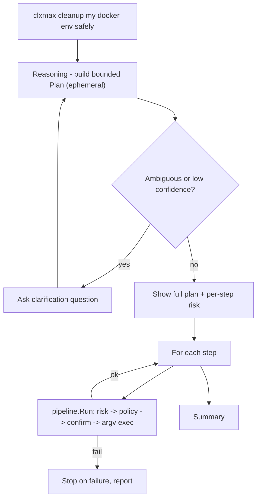

# Phase 5 — clxmax Advanced Reasoning (Version 2)

> **Status:** Planned.
>
> Version 2 development tracker. The shipped **v1.0.0** tool covers Phases 1–4 + 3.5 (`clx`). Phase 5 delivers **`clxmax`** as a second binary reusing the v1 engine with an advanced reasoning layer.

---

## Versioning

| Version | Binary | Scope | Status |
|---------|--------|-------|--------|
| **1.0.0** | `clx` | Phases 1, 2, 3, 3.5, 4 + V1 polish | Shipped |
| **2.0.0** | `clxmax` | Phase 5 — reasoning, planning, clarification | In development |

See [CHANGELOG.md](../CHANGELOG.md) for release notes.

---

## Goal

`clxmax` is the same engine as `clx` plus a reasoning layer that can:

- **Reason** about a complex natural-language request
- **Plan** and chain multiple commands in order
- **Ask follow-up questions** when intent is ambiguous or confidence is low
- **Handle complex workflows** (e.g. `clxmax cleanup my docker environment safely`)

Example from the product vision:

```bash
clxmax cleanup my docker environment safely
```

Expected behavior (when complete): decompose the request into a bounded plan, show per-step risk, confirm, then execute each step through the standard safety gates.

---

## Hard constraints

These are non-negotiable and shape every sub-phase.

### Safe-command-execution

Every plan step individually passes the full pipeline:

```
Generate → Risk → Policy → DryRun → Confirm → argv-only Exec
```

- LLM output is **untrusted** — structured plans and `argv` only, never shell strings.
- Reuse `executor.ValidateGeneratedArgv` per step.
- No `sh -c` / `powershell -Command` / `cmd /c` with user or AI interpolated content.
- No skipping risk or policy gates for any step.

### Memory-management

Plans are **ephemeral / session-scoped only**:

- No persisted goal-trees, task queues, or autonomous planning state.
- A plan exists for one invocation and is discarded when the process exits.
- Session memory (`internal/memory`) may record executed commands after the fact; it does **not** store planning state.

**Decision:** ephemeral in-memory plan (Option A). Do not amend the memory-management rule.

### Runtime-footprint

- Reuse lazy provider init from v1 (no network at startup).
- Reasoning loop is `ctx`-bounded with an explicit step cap.
- Bounded plan size (max steps, max tokens per step) enforced at validation.

---

## Architecture

### Reuse

- [`internal/pipeline/run.go`](../internal/pipeline/run.go) — `Run(ctx, cfg, rawInput, opts)` executes **one** gated command per call. Each plan step invokes this (or a thin wrapper).
- [`cmd/clxmax`](../cmd/clxmax/main.go) — wires config, logging, and the reasoning loop (replacing the current stub message).
- Existing providers, risk, policy, executor, and cache packages — unchanged contracts.

### New surface (proposed)

| Package | Responsibility |
|---------|----------------|
| `internal/reasoning` (proposed) | Build a bounded, ephemeral `Plan` from a single NL request; clarification loop; plan validation |
| `internal/providers` | New optional capability: `PlanGenerator` (analogous to `CommandGenerator`) — returns structured plan steps, not shell strings |

### Flow



### Provider contract (proposed)

```go
// Optional capability — providers that implement it can synthesize a multi-step plan.
type PlanGenerator interface {
    GeneratePlan(ctx context.Context, req PlanRequest) (*PlanResponse, error)
}

type PlanRequest struct {
    RawInput     string
    Profile      environment.SystemProfile
    KnownIntents []string
    RuleParams   map[string][]string
    Clarification string // prior user answer, if any
}

type PlanStep struct {
    Description string            // human-readable step label
    Intent      string            // closed-vocabulary intent name, OR
    Argv        []string          // structured argv when intent miss (validated like CommandGenerator)
    Params      map[string]string // when Intent is set
}

type PlanResponse struct {
    Steps          []PlanStep
    NeedsClarify   bool
    ClarifyQuestion string
    Confidence     float64
}
```

Plan output is validated (step cap, intent in known set, params match schema, argv passes `ValidateGeneratedArgv`) before any execution.

---

## Status snapshot

| Sub-phase | Scope | Status | Notes |
|-----------|-------|--------|-------|
| **5.1** | clxmax wiring | Planned | Replace stub; single-step parity with `clx` |
| **5.2** | Clarification loop | Planned | Bounded question round on ambiguity |
| **5.3** | Multi-step planning | Planned | Ephemeral bounded plan from provider |
| **5.4** | Sequenced execution | Planned | Per-step safety gates, stop-on-failure |
| **5.5** | Plan explainability | Planned | `--explain` shows full plan, zero side effects |

---

## Sub-phases (detail)

### 5.1 — clxmax wiring

**Scope:** Replace stub entrypoint; wire real pipeline for single-step requests.

**Packages:** `cmd/clxmax`, `internal/pipeline`

**Exit criteria:**

- `clxmax grep errors logs.txt` behaves like `clx grep errors logs.txt` (same translation + gates).
- `clxmax --version` reports `2.x` (via `CLXMAX_VERSION` in Makefile).
- Stub message removed; help text references Version 2 / Phase 5.

---

### 5.2 — Clarification loop

**Scope:** When plan generation returns `NeedsClarify`, prompt the user once (bounded); re-invoke planner with the answer.

**Packages:** `internal/reasoning`, `cmd/clxmax`

**Exit criteria:**

- Ambiguous input triggers one clarification question on a TTY.
- Non-interactive mode (`-y` / no TTY): exit with a clear error, no hang.
- Clarification answer is redacted in logs.

---

### 5.3 — Multi-step planning

**Scope:** Provider returns a bounded ordered plan (structured, validated, capped step count); plan is ephemeral only.

**Packages:** `internal/reasoning`, `internal/providers/*`

**Exit criteria:**

- Multi-step request (e.g. docker cleanup) yields a validated N-step plan (N ≤ configured max, default TBD).
- No plan state persisted to disk or session memory.
- Invalid plan output (unknown intent, bad argv, over cap) is rejected with a clear error.

---

### 5.4 — Sequenced execution

**Scope:** Run plan step-by-step; **each** step through full safety gates; stop-on-failure; per-step confirmation (configurable).

**Packages:** `internal/reasoning`, `internal/pipeline`, `test/`

**Exit criteria:**

- E2E test proves every step hits risk + policy before exec.
- A blocked or failed step halts the plan; prior steps' effects are reported.
- Medium/high-risk steps always require confirmation (same as v1).

---

### 5.5 — Plan explainability

**Scope:** `--explain` / preview mode shows the whole plan + per-step risk before any execution.

**Packages:** `cmd/clxmax`, `internal/reasoning`

**Exit criteria:**

- `clxmax --explain cleanup my docker environment safely` prints the plan with per-step risk labels.
- Zero side effects (no subprocess exec, no cache writes beyond explain path).

---

## Decisions

| Topic | Decision | Rationale |
|-------|----------|-----------|
| Plan persistence | **Ephemeral (in-memory per invocation)** | Aligns with memory-management rule; no goal trees |
| Config | **Reuse `~/.clx/config.yaml`** | Same provider, safety, policy; optional `clxmax:` section later if needed |
| Step cap | **Default 8 steps** (proposed) | Bounded; tunable via config in 5.3 |
| Confirmation | **Per-step default**; optional whole-plan preview first | Trust + safety; user sees each gate |
| Reasoning prompts | **Extend skills `prompts.yaml`** per domain | Reuse Phase 4.5 pattern; no new prompt surface |
| Binary versioning | **`CLXMAX_VERSION` separate from `VERSION`** | v1.0.0 clx shipped; v2.x-dev clxmax in flight |

---

## Tasks

- [ ] Replace clxmax stub with pipeline wiring (5.1)
- [ ] Separate `CLXMAX_VERSION` in release builds (5.1 — done in Makefile for dev builds)
- [ ] Add `internal/reasoning` package with plan types and validation
- [ ] Add `PlanGenerator` provider capability + Ollama/OpenAI adapters
- [ ] Clarification loop with TTY / non-interactive handling (5.2)
- [ ] Multi-step plan generation with step cap (5.3)
- [ ] Sequenced execution with per-step gates and stop-on-failure (5.4)
- [ ] Plan explain mode (5.5)
- [ ] E2E tests for multi-step plan + blocked step halts plan
- [ ] Update CHANGELOG `[Unreleased]` as sub-phases land

---

## Update log

```
```
