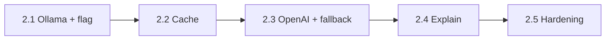

# Phase 2 — AI Integration

> **Status:** Not started. Foundation prepped (resolver chain, `ValidateResolved`, embedded rules).
>
> This doc is both the implementation plan **and** the live tracker. Flip
> checkboxes (`[ ]` → `[x]`) and append to the **Update log** at the bottom as
> work lands. Cross-reference `doc/architecture.md` §3.10 (Provider) and
> §6 (Phases) for the architectural source of truth.

---

## Status snapshot

| Sub-phase | Scope | Status | Last commit | Notes |
|-----------|-------|--------|-------------|-------|
| **2.1** | Provider interface + Ollama + `--provider` flag + AI fallback wiring | 🟡 In progress | 8948818+ | Foundation + Ollama client wired; e2e stubs green. |
| **2.2** | Intent cache (`internal/cache`) | ⬜ Not started | — | Insert between rules and AI in resolver chain. |
| **2.3** | OpenAI provider | ⬜ Not started | — | Adds cross-provider fallback option. |
| **2.4** | AI-driven `Explain()` wiring | ⬜ Not started | — | Optional polish; can defer to Phase 4. |
| **2.5** | Hardening: redaction audit, docs, CI budget recheck | ⬜ Not started | — | Closes the phase. |

Legend: ⬜ Not started · 🟡 In progress · ✅ Done · 🛑 Blocked

---

## TL;DR

Phase 2 turns CLX from "rule translator" into "understands me." The user-visible
deliverable: natural-language inputs that miss the rules engine
(`clx find all files modified today`) resolve via a local LLM (Ollama) and run
end-to-end through the existing safety pipeline. The pipeline shape does not
change — AI is appended as one more `intent.Resolver` in the chain that already
exists.

**What lands at the end of Phase 2:**

- Local-first AI fallback via Ollama, opt-in via `cfg.Provider`
- Optional cloud fallback via OpenAI
- File-backed intent cache to avoid repeat LLM calls
- AI-validated against the closed intent vocabulary before any template
  substitution (see safe-command-execution rule)

**What does NOT land:** memory, embeddings, vector stores, repo indexing,
shell hooks, alias system. All Phase 3.5+ or excluded entirely.

---

## Foundation already in place

The resolver-chain commit (`b1ba183`) and surrounding work landed everything
below before Phase 2 started. **Do not redo any of this.**

| Capability | Where |
|------------|-------|
| `intent.Resolver` interface (`Resolve(ctx, req) → (ResolvedIntent, error)`) | `internal/intent/resolver.go` |
| Generic resolver chain with `ErrNotFound` short-circuit, ctx honoring, debug logs | `internal/pipeline/resolve.go` |
| `Options.AIResolver` field already piped into `pipeline.Run` | `internal/pipeline/options.go`, `run.go` |
| `IntentSource` enum extended (`SourceRule`, `SourceCache`, `SourceAI`, `SourceMemory`) | `internal/intent/resolve.go` |
| `Engine.KnownIntents()` returns the closed AI vocabulary | `internal/intent/engine.go` |
| `Engine.ValidateResolved()` schema-checks any non-Rule output | `internal/intent/engine.go` |
| Pipeline rejects untrusted resolver output before generator runs | `internal/pipeline/run.go:57-69` |
| Embedded built-in rules + `~/.clx/rules` user overlay | `internal/builtin/`, `internal/intent/overlay.go` |
| Config schema for all three providers (Ollama / OpenAI / Azure) | `internal/config/config.go` |
| Cross-platform exec including PS cmdlets and CMD builtins (Phase 1.7) | `internal/executor/`, `internal/generator/exechost.go` |

---

## Locked decisions (do not relitigate without doc update)

| # | Decision | Rationale |
|---|----------|-----------|
| **D1** | **One global prompt** for AI resolution. Per-domain prompts (`skills/<domain>/prompts.yaml`) deferred to Phase 4. | Single prompt is a smaller surface area to reason about and to red-team. The closed-vocabulary intent list grounds it sufficiently for V1. |
| **D2** | **Hard-fail when the configured provider is unavailable.** No cross-provider fallback in 2.1. | Predictable UX. A user who configured `provider: ollama` deserves a clear error if Ollama is down — not silent escalation to a cloud API they didn't ask for. Cross-provider fallback opt-in lands in 2.3. |
| **D3** | **`--provider` flag ships in 2.1**, even though only Ollama is implemented. | Stable CLI surface from day one. `--provider openai` returns a clean "not implemented yet" error in 2.1 and starts working in 2.3 without a flag rename. |
| **D4** | **Default Ollama model is `qwen3:4b`** (Apache 2.0, ~3 GB Q4, native tool/JSON support). Tested alternates documented in `internal/config/defaults.go` and `configs/config.example.yaml`: `qwen3:1.7b` (lightest), `qwen2.5:7b` (quality bump), `llama3.1:8b` (Meta-ecosystem). | Closed-vocabulary intent extraction is a classification + light entity-extraction task. `qwen3:4b` matches Qwen 2.5 7B quality at ~half the size, has native tool calling, and pairs well with Ollama's schema-constrained structured outputs (the real hallucination defense). Avoided as defaults: `llama3.2:3b` (unreliable for >1 param extraction), `phi3.5:mini` (hallucinates tool args), `gemma2:*` (weak tool calling), `llama3` (predates the modern tool-use fine-tune line). |
| **D5** | **Schema-constrained structured outputs (`format: <jsonschema>`) from day one.** Schema built dynamically from `Engine.KnownIntents()` + `Rule.Params` in 2.1.3 (`internal/providers/schema.go`). `ValidateResolved` remains defense-in-depth. | Grammar-constrained decoding makes out-of-vocab intents and undeclared param keys physically impossible at the wire, not only rejected at the gate. |

---

## Sub-phase summary



Each sub-phase is independently shippable. 2.4 may be deferred to Phase 4 with
no impact on the rest.

---

## Phase 2.1 — Ollama provider + AI fallback

> **Goal:** rules-miss inputs resolve via Ollama and run end-to-end. Adversarial
> AI output is rejected before exec. Provider unavailable → hard-fail.

### 2.1 — Behavior contract

| Input | `cfg.Provider` | Provider state | Result |
|-------|----------------|----------------|--------|
| Rule match (`git status`) | any | n/a | Rules path. Provider **never called**. |
| Rule miss + NL | `ollama` | up | AI resolves → `ValidateResolved` → translate → run |
| Rule miss + NL | `ollama` | down (refused / 5xx / timeout) | **Hard-fail.** Stderr `provider unavailable: …`. Exit 1. |
| Rule miss + NL | `openai` | n/a | Stderr `openai provider not implemented yet (Phase 2.3)`. Exit 1. |
| Rule miss + AI returns `rm_rf_slash` | `ollama` | up | Pipeline rejects via `ValidateResolved`. Exit 1. |
| Rule miss + AI returns extra param | `ollama` | up | Same rejection path. |
| Rule miss + AI confidence < 0.5 | `ollama` | up | Treated as miss → `ErrNotFound` propagates. |
| `--provider openai foo` | (any) | n/a | Flag wins over config; same not-implemented error. |
| `--provider bogus foo` | (any) | n/a | Exit 2 (flag error). |
| `--explain` on rule miss | `ollama` | up | AI called, intent shown, **no exec**. |
| `--dry-run` on rule miss | `ollama` | up | AI called, `dry-run: would execute: …` printed. |

### 2.1 — Files to add

```
internal/
└── providers/
    ├── provider.go              # Provider iface, IntentRequest, typed errors
    ├── adapter.go               # Provider → intent.Resolver bridge
    ├── adapter_test.go
    ├── adapter_security_test.go # adversarial cases (rm_rf_slash, extra param)
    ├── prompt.go                # single global prompt builder
    ├── prompt_test.go
    ├── factory.go               # NewFromConfig(cfg) → (Provider, error)
    ├── factory_test.go
    └── ollama/
        ├── client.go            # HTTP client, /api/chat, format: json
        ├── client_test.go       # httptest fakes
        ├── provider.go          # Provider impl wrapping client
        └── provider_test.go
```

Touched (not added):

- `internal/pipeline/options.go` — add `Engine *intent.Engine` field (see 2.1.6)
- `internal/pipeline/run.go` — use `Options.Engine` if provided
- `cmd/clx/main.go` — `--provider` flag, factory call, AI resolver wiring
- `cmd/clx/main_test.go` — flag tests
- `test/pipeline_ai_e2e_test.go` — new e2e suite
- `doc/architecture.md` — update §3.10 with the 2.1 contract; mark phase row
- `README.md` — Phase 2.1 status line

### 2.1 — Tasks (commit-by-commit tracker)

Each task is one commit. Each commit must compile and keep `go test -race ./...`
green. Mark the box when the commit lands on `development`.

#### 2.1.1 Provider interface and types
- [x] Add `internal/providers/provider.go` with `Provider`, `IntentRequest`,
      `IntentResponse`, and typed errors (`ErrUnavailable`, `ErrTimeout`,
      `ErrInvalidResp`, `ErrNoMatch`).
- [x] No imports from `internal/memory` (provider layer must stay stateless).
- [x] No `init()`, no goroutines, no I/O.

#### 2.1.2 Single global prompt builder
- [x] Add `internal/providers/prompt.go` exporting `BuildPrompt(req) (system, user string)`.
- [x] System message is a package-level constant (computed via `sync.Once` if templated).
- [x] User message includes: OS, shell, available tools, allowed intents (capped at 256), raw input.
- [x] Whole prompt capped at 8 KB pre-send; over-cap returns a clear error.
- [x] `prompt_test.go`: profile fields present, intents present, bounded size, deterministic output.

#### 2.1.3 Ollama HTTP client
- [x] Add `internal/providers/ollama/client.go`. Endpoint: `POST {host}/api/chat`,
      `format: <jsonschema>` (built by `internal/providers/schema.go` from
      `IntentRequest.KnownIntents` + `IntentRequest.RuleParams`), `stream: false`,
      `temperature: 0.0`.
- [ ] `http.Client` with explicit `Timeout`. **No** `http.DefaultClient`.
- [ ] User-Agent: `clx/<cliversion.Version>`.
- [ ] Response read via `io.LimitReader(body, 64*1024)` — never `io.ReadAll`.
- [ ] Error mapping: connect refused / DNS / TLS / 5xx → `ErrUnavailable`;
      ctx deadline → `ErrTimeout`; 4xx → `ErrInvalidResp`; body parse fail → `ErrInvalidResp`;
      empty intent → `ErrNoMatch`.
- [ ] `client_test.go`: happy path, server down, timeout, HTTP 500, HTTP 400,
      bounded read on 1 MB body, no network on `New()`.

#### 2.1.4 Ollama Provider impl
- [ ] Add `internal/providers/ollama/provider.go` wrapping the client.
- [ ] `Name()` returns `"ollama"`.
- [ ] `ResolveIntent` builds prompt via `providers.BuildPrompt`, calls client, returns typed `IntentResponse`.
- [ ] `Explain` returns `("", nil)` for now (wired in 2.4).
- [ ] `provider_test.go`: round-trip with httptest server.

#### 2.1.5 Factory + adapter
- [ ] Add `internal/providers/factory.go`: `NewFromConfig(cfg) → (Provider, error)`.
      `ollama` → ollama client; `openai` and `azure` → clean "not implemented in Phase 2.1" error.
- [ ] Add `internal/providers/adapter.go`: `AsResolver(p, eng, logger, AdapterConfig)`
      returning an `intent.Resolver`.
- [ ] `AdapterConfig`: `MinConfidence` (default 0.5), `Timeout`
      (capped: `min(cfg.Execution.Timeout, 10*time.Second)`).
- [ ] Adapter logs latency, intent name, confidence; raw input passed through `executor.Redact` first.
- [ ] Adapter never logs param values, never logs raw response body.
- [ ] Adapter maps errors: `ErrNoMatch` / `ErrInvalidResp` → `intent.ErrNotFound`;
      `ErrUnavailable` / `ErrTimeout` → propagate as-is (pipeline hard-fails).
- [ ] `adapter_test.go` + `adapter_security_test.go` per the test matrix below.

#### 2.1.6 Engine injection refactor
- [ ] Add `Engine *intent.Engine` to `pipeline.Options`.
- [ ] `pipeline.Run` uses `opts.Engine` if non-nil; else builds via `intent.NewEngineWithOverlay` (preserves existing tests).
- [ ] `cmd/clx/main.go` builds the engine once, passes it to both `pipeline.Options` and the AI factory.
- [ ] Verify cold-start budget unaffected (`make budgets`).

#### 2.1.7 CLI wiring (`--provider` flag, AI resolver construction)
- [ ] Add `--provider` string flag to `cmd/clx/main.go` flagset.
- [ ] If flag set: override `cfg.Provider`, re-run `config.Validate(cfg)`. Bad value → exit 2.
- [ ] Build `intent.Resolver` from factory; pass into `pipeline.Options.AIResolver`.
- [ ] Factory must do **zero** network I/O — provider construction is lazy.
- [ ] Update `printHelp(w)` with `--provider` line.
- [ ] `cmd/clx/main_test.go`: flag override accepted, bogus value rejected, factory not-impl errors propagate cleanly.

#### 2.1.8 End-to-end test suite
- [ ] Add `test/pipeline_ai_e2e_test.go`. Use stub `intent.Resolver` (not real Ollama)
      to keep the suite hermetic.
- [ ] `TestE2EAIRulePathBypassesAI` — `git status` resolves via rules; stub resolver `calls == 0`.
- [ ] `TestE2EAIRulesMissThenAIHit` — stub returns valid intent; pipeline runs end-to-end.
- [ ] `TestE2EAIRejectsMaliciousIntent` — stub returns `rm_rf_slash`; exit 1; stderr matches `untrusted resolver output rejected`.
- [ ] `TestE2EAIProviderDownHardFails` — stub returns `providers.ErrUnavailable`; exit 1; stderr matches `provider unavailable`.
- [ ] `TestE2EAIProviderFlagOverride` — `--provider openai` returns the not-implemented error (factory-level).
- [ ] `TestE2EAILowConfidenceTreatedAsMiss` — stub returns confidence 0.2; falls through to existing "no matching rule" message.

#### 2.1.9 Docs and status update
- [ ] Update `doc/architecture.md` §3.10 with the 2.1-final Provider contract (errors, timeouts, redaction).
- [ ] Mark the Phase 2 row in `doc/architecture.md` §6 as in progress.
- [ ] Update `README.md` status line: `Phase 2.1 — Ollama AI fallback`.
- [ ] Flip 2.1 row in this doc's status snapshot to ✅ when all boxes are checked.

### 2.1 — Acceptance gates (merge checklist)

- [ ] `go test -race ./...` clean on Linux, macOS, Windows (CI green on `development`)
- [ ] `make budgets` green — no cold-start or binary-size regression
- [ ] `clx --version` makes **zero** network calls (lazy provider)
- [ ] `clx git status` makes **zero** network calls (rules path; AI not invoked)
- [ ] Adversarial fake resolver returning `rm_rf_slash` rejected pre-exec (e2e test green)
- [ ] No new `exec.Command` outside `internal/executor` (forbidigo / `gosec G204`)
- [ ] `goleak` clean for `internal/providers/ollama`
- [ ] Provider request/response log lines pass through `executor.Redact`
- [ ] `--provider openai` returns a clean error, not a panic
- [ ] No new direct dep in `go.mod` without one-line justification in PR
- [ ] CGO still off; release builds still `-trimpath -ldflags="-s -w"`

### 2.1 — Test matrix (mapping to safe-exec rule)

| Threat | Test | File |
|--------|------|------|
| AI returns unknown intent name | `TestAdapterRejectsUnknownIntent` (via pipeline `ValidateResolved`) | `internal/providers/adapter_security_test.go` + e2e |
| AI returns extra param | `TestAdapterRejectsExtraParam` | same |
| AI returns missing required param | covered by `Engine.ValidateResolved` existing tests; add coverage call from adapter | same |
| Provider hangs | `TestClientTimeout` + ctx cap at 10s | `internal/providers/ollama/client_test.go` |
| Provider returns 1 MB body | `TestClientBoundedRead` | same |
| Secret-shaped input in logs | `TestAdapterRedactsInDebugLogs` | `internal/providers/adapter_test.go` |
| `--provider` flag bypasses validation | `TestRunProviderFlagInvalidValue` | `cmd/clx/main_test.go` |

### 2.1 — Out of scope (explicit)

- Cross-provider fallback (lands in 2.3)
- Per-domain prompts (Phase 4)
- Cache (lands in 2.2)
- AI-driven `--explain` (lands in 2.4)
- Streaming responses
- Tool / function calling — not on roadmap; intent vocabulary is the schema
- Embeddings, vector stores — banned by memory-management rule

---

## Phase 2.2 — Intent cache *(outline)*

> **Goal:** memoize `(input, os, shell, tools_hash) → ResolvedIntent` to skip
> repeat AI calls. Inserted between rules and AI in the resolver chain.

- [ ] Create `internal/cache/cache.go` — file-backed kv at `~/.clx/cache/`
- [ ] Bounded: max entries (default 1024, LRU), TTL (default 30 days), max disk size (default 5 MB) — all in `config.yaml` under `cache:`
- [ ] Cache key: SHA-256 of `tokens + profile.OS + profile.Shell + sorted(profile.AvailableTools)`
- [ ] Adapter: `internal/cache/resolver.go` — read on `Resolve`, write-through on AI hit
- [ ] Wire into `pipeline.buildResolvers`: chain becomes `[rules, cache, ai]`
- [ ] Honor `cfg.Features.CacheCommands` (already present in config)
- [ ] Tests: cache miss/hit, TTL expiry, profile-change miss, corrupt file graceful degrade
- [ ] Update this doc's status snapshot when complete

---

## Phase 2.3 — OpenAI provider + cross-provider fallback *(outline)*

> **Goal:** second provider impl, optional fallback chain.

- [ ] Create `internal/providers/openai/` mirroring the Ollama package layout
- [ ] REST client to OpenAI chat completions, JSON-mode response, key from `cfg.Providers.OpenAI.APIKey`
- [ ] API key never logged; redacted on display
- [ ] Add `providers:` config section: `primary`, `fallback` (optional)
- [ ] Factory returns a chain provider that tries primary then fallback on `ErrUnavailable`
- [ ] Adversarial test suite mirrors 2.1 (`ValidateResolved` is the unified gate)
- [ ] `--provider` flag now accepts `openai`
- [ ] Update this doc's status snapshot when complete

---

## Phase 2.4 — AI-driven explanations *(outline, optional)*

> **Goal:** richer `--explain` output backed by AI.
> May defer to Phase 4 if velocity is needed.

- [ ] In `internal/pipeline/display.go`, when AI provider available and `--explain`
      set, call `Provider.Explain(gen)` with tight 2s timeout
- [ ] Graceful fallback to static `explanationFor(intent)` map on timeout/error
- [ ] Cache explanations (same key + intent name) — depends on 2.2
- [ ] Tests: AI text shown when provider up; static fallback when down; never blocks exec
- [ ] Update this doc's status snapshot when complete

---

## Phase 2.5 — Hardening + observability *(outline)*

> **Goal:** close out cross-cutting items accumulated across 2.1–2.4.

- [ ] Redaction audit: every provider request/response field passes through `executor.Redact` before logging
- [ ] New `~/.clx/cache/` entry documented in `doc/architecture.md` §4 runtime layout
- [ ] Provider config validation in `internal/config/loader.go`: bad host URL, missing API key when `provider: openai`
- [ ] Optional: `providers.timeout` config key (otherwise 10s ceiling stays hardcoded)
- [ ] CI budget script still green with provider compiled in
- [ ] Canonical adversarial e2e test: a fake provider's raw output cannot reach `os/exec` without passing argv-only validation, risk, policy, and confirmation
- [ ] README status updated to `Phase 2 complete`
- [ ] Update this doc's status snapshot when complete

---

## Cross-cutting non-negotiables

These apply to every commit in Phase 2. They mirror the workspace rules
(`.cursor/rules/safe-command-execution.mdc`, `runtime-footprint.mdc`,
`memory-management.mdc`).

| # | Constraint |
|---|------------|
| C1 | No `exec.Command` outside `internal/executor`. AI providers do **not** invoke shell. |
| C2 | Provider layer (`internal/providers/*`) stays **stateless** — never imports `internal/memory`. |
| C3 | Every `Provider.ResolveIntent` call wraps a `context.WithTimeout` capped at 10 seconds. |
| C4 | Every HTTP call uses an explicit `http.Client` with `Timeout`, not `http.DefaultClient`. |
| C5 | Every response body read via `io.LimitReader`, never `io.ReadAll`. |
| C6 | Every `ResolvedIntent` from a non-Rule source passes through `Engine.ValidateResolved` before generator. |
| C7 | Every provider request/response log entry passes through `executor.Redact`. Never log API keys, never log full param values. |
| C8 | No `init()` side effects in any new package. Construction is lazy and explicit. |
| C9 | New direct deps in `go.mod` require a one-line PR justification. Forbidden: ORMs, web frameworks, reflection-heavy serializers, deps with > 5 transitive deps. |
| C10 | `goleak` in test teardown for any package that spawns goroutines (HTTP clients can leak conn pool goroutines if not closed). |

---

## Risks and open questions

| # | Item | Owner | Status |
|---|------|-------|--------|
| R1 | Ollama `/api/chat` schema-constrained `format` requires Ollama ≥ 0.5. Fallback: `format: "json"` and rely on `ValidateResolved`; older fallback: `/api/generate` with one-shot prompt (1-line change in `client.go`). | TBD | Open |
| R2 | Cold-start budget impact of importing `net/http` (~few hundred KB binary growth). Confirm with `make budgets` after 2.1.7. | TBD | Open |
| R3 | Confidence threshold of 0.5 is a guess. Tune after first round of real Ollama responses. | TBD | Open |
| R4 | `cfg.Provider == "ollama"` but `Ollama.Host` empty: factory should fail with a clear "ollama.host required" message, not crash. | Covered in 2.1.5 | Open |
| R5 | What happens on Windows when `cfg.Providers.Ollama.Host` is `localhost` and Ollama is in WSL? Document but defer; Phase 4 owns shell/host integration. | TBD | Open |

---

## Update log

Append one line per merged commit. Format: `YYYY-MM-DD · <task id> · <short summary> · <commit sha>`.

```
(empty — Phase 2 not started)
```

---

## How to use this doc

1. Pick the next unchecked task in the active sub-phase.
2. Implement it in one commit on `development`.
3. Flip the box, add a line to **Update log**, push.
4. When all boxes in a sub-phase are checked, flip the row in the **Status snapshot** to ✅ and link the final commit.
5. If a decision changes, update the **Locked decisions** table in the same commit that implements the change. Never silently diverge from this doc.
