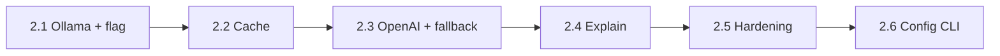

# Phase 2 — AI Integration

> **Status:** Phase 2 complete (2.1–2.8). Phase 3 (Safety) or Phase 4 (Advanced UX) next.
>
> This doc is both the implementation plan **and** the live tracker. Flip
> checkboxes (`[ ]` → `[x]`) and append to the **Update log** at the bottom as
> work lands. Cross-reference `doc/architecture.md` §3.10 (Provider) and
> §6 (Phases) for the architectural source of truth.

---

## Status snapshot

| Sub-phase | Scope | Status | Last commit | Notes |
|-----------|-------|--------|-------------|-------|
| **2.1** | Provider interface + Ollama + `--provider` flag + AI fallback wiring | ✅ Done | 9f35917 | Provider iface, Ollama HTTP client + provider, factory, adapter, `--provider` flag, engine injection, hermetic e2e suite all green. |
| **2.2** | Intent cache (`internal/cache`) | ✅ Done | be1c59f | File-backed LRU at ~/.clx/cache/intents.json; chain [rules, cache, ai]; write-through on AI hits. |
| **2.3** | OpenAI provider + cross-provider fallback | ✅ Done | f47ff62 | OpenAI chat completions, primary/fallback config, chain on ErrUnavailable only. |
| **2.4** | AI-driven `Explain()` wiring | ✅ Done | 05196f9 | AI explain on --explain + AI/Cache source; explanations.json cache; 2s timeout. |
| **2.5** | Hardening: redaction audit, docs, CI budget recheck | ✅ Done | 1d48cd4 | providers.timeout, host URL validation, security e2e, Phase 2 close-out. |
| **2.6** | Provider config CLI + encrypted secrets | ✅ Done | — | `clx config` subcommand, enc:v1 API keys, machine-bound encryption, provider-scoped set/get/show. |
| **2.7** | Google Gemini provider | ✅ Done | — | Gemini generateContent API, structured output via responseSchema, schema adaptation (strip additionalProperties), CommandGenerator support, enc:v1 secret, default model gemini-2.0-flash. |
| **2.8** | Safety mode CLI + mode×risk matrix | ✅ Done | — | `clx safety` subcommand; `DecideSafetyAction` preset matrix; preview-then-confirm in high mode; custom global toggles. |

Legend: ⬜ Not started · 🟡 In progress · ✅ Done · 🛑 Blocked

---

## TL;DR

Phase 2 turns CLX from "rule translator" into "understands me." The user-visible
deliverable: natural-language inputs that miss the rules engine
(`clx find all files modified today`) resolve via a local LLM (Ollama) and run
end-to-end through the existing safety pipeline. The pipeline shape does not
change — AI is appended as one more `intent.Resolver` in the chain that already
exists.

**What lands at the end of Phase 2:**

- Local-first AI fallback via Ollama, opt-in via `cfg.Provider`
- Optional cloud fallback via OpenAI
- File-backed intent cache to avoid repeat LLM calls
- AI-validated against the closed intent vocabulary before any template
  substitution (see safe-command-execution rule)

**What does NOT land:** memory, embeddings, vector stores, repo indexing,
shell hooks, alias system. All Phase 3.5+ or excluded entirely.

---

## Foundation already in place

The resolver-chain commit (`b1ba183`) and surrounding work landed everything
below before Phase 2 started. **Do not redo any of this.**

| Capability | Where |
|------------|-------|
| `intent.Resolver` interface (`Resolve(ctx, req) → (ResolvedIntent, error)`) | `internal/intent/resolver.go` |
| Generic resolver chain with `ErrNotFound` short-circuit, ctx honoring, debug logs | `internal/pipeline/resolve.go` |
| `Options.AIResolver` field already piped into `pipeline.Run` | `internal/pipeline/options.go`, `run.go` |
| `IntentSource` enum extended (`SourceRule`, `SourceCache`, `SourceAI`, `SourceMemory`) | `internal/intent/resolve.go` |
| `Engine.KnownIntents()` returns the closed AI vocabulary | `internal/intent/engine.go` |
| `Engine.ValidateResolved()` schema-checks any non-Rule output | `internal/intent/engine.go` |
| Pipeline rejects untrusted resolver output before generator runs | `internal/pipeline/run.go:57-69` |
| Embedded built-in rules + `~/.clx/rules` user overlay | `internal/builtin/`, `internal/intent/overlay.go` |
| Config schema for all three providers (Ollama / OpenAI / Azure) | `internal/config/config.go` |
| Cross-platform exec including PS cmdlets and CMD builtins (Phase 1.7) | `internal/executor/`, `internal/generator/exechost.go` |

---

## Locked decisions (do not relitigate without doc update)

| # | Decision | Rationale |
|---|----------|-----------|
| **D1** | **One global prompt** for AI resolution. Per-domain prompts (`skills/<domain>/prompts.yaml`) deferred to Phase 4. | Single prompt is a smaller surface area to reason about and to red-team. The closed-vocabulary intent list grounds it sufficiently for V1. |
| **D2** | **Hard-fail when the configured provider is unavailable.** No cross-provider fallback in 2.1. | Predictable UX. A user who configured `provider: ollama` deserves a clear error if Ollama is down — not silent escalation to a cloud API they didn't ask for. Cross-provider fallback opt-in lands in 2.3. |
| **D3** | **`--provider` flag ships in 2.1**, even though only Ollama is implemented. | Stable CLI surface from day one. `--provider openai` returns a clean "not implemented yet" error in 2.1 and starts working in 2.3 without a flag rename. |
| **D4** | **Default Ollama model is `qwen3:1.7b`** (~1.4 GB, Apache 2.0, schema/JSON). **Quality tier:** `qwen3:4b` when GPU/RAM allows. Benchmark: `scripts/bench-ollama-models.ps1` on CPU — `gemma3:270m` fast but wrong intent; `qwen3:1.7b` ~67s correct; `qwen3:4b` ~179s correct. Alternates in `defaults.go`: `qwen2.5:7b`, `llama3.1:8b`. | Intent resolution is closed-vocabulary classification + light param extraction. `qwen3:1.7b` is the best speed/accuracy tradeoff on CPU-only hosts; `qwen3:4b` when latency budget allows. Avoid: `gemma3:270m` (unreliable intent pick), `llama3` / `llama3:latest` (predates tool JSON line, large), `llama3.2:3b`, `phi3.5:mini`. |
| **D5** | **Schema-constrained structured outputs (`format: <jsonschema>`) from day one.** Schema built dynamically from `Engine.KnownIntents()` + `Rule.Params` in 2.1.3 (`internal/providers/schema.go`). `ValidateResolved` remains defense-in-depth. | Grammar-constrained decoding makes out-of-vocab intents and undeclared param keys physically impossible at the wire, not only rejected at the gate. |
| **D6** | **`ProvidersConfig.Primary` / `Fallback` alongside nested provider settings (option A).** Top-level `provider:` remains backward-compatible. | Minimal config churn; existing `providers.ollama` / `openai` / `azure` blocks unchanged. |
| **D7** | **Effective primary** = `providers.primary` if non-empty, else `provider`. Factory builds one provider or chain from this. | Explicit chain config without breaking existing single-provider setups. |
| **D8** | **Fallback is opt-in** via `providers.fallback`. Unset → D2 hard-fail when primary is down. | Predictable UX; no silent cloud escalation. |
| **D9** | **Fallback triggers on `ErrUnavailable` only** (connect refused, DNS, TLS, 5xx). No fallback on timeout, invalid response, or no-match. | Avoids surprise cloud spend on slow local CPU or bad model output. |
| **D10** | **`--provider` disables fallback** for that invocation (`cfg.Providers.Fallback` cleared in main). | Flag implies single-provider semantics (extends D3). |
| **D11** | **AI Explain runs only when `--explain` is set** (`opts.Explain`) **and** `resolved.Source` is `SourceAI` or `SourceCache`. Dry-run / confirm display without `--explain` keeps static `gen.Explanation`. | Avoids LLM spend on every dry-run preview; Explain is an explicit UX opt-in. |
| **D12** | **Explain chain: primary-only** (`chain.Explain` delegates to primary). On any Explain error/timeout → static fallback; no cross-provider Explain fallback. | Explain is best-effort polish; infra fallback belongs on ResolveIntent (D9). |
| **D13** | **Explanation cache:** separate file `~/.clx/cache/explanations.json`, same bounded LRU/TTL/disk caps as intent cache (`cache:` config). Key: SHA-256 of `intent + shell + joined(argv)`. | Keeps intent cache schema stable; explanations are display-only blobs. |
| **D14** | **Explain timeout:** hardcoded **2s** ceiling, independent of `execution.timeout` / `providers.timeout`. Never blocks exec. | Fast fallback to static text; exec path unaffected. |
| **D15** | **Explain output is display-only.** Plain-text LLM response (no JSON schema). Never substituted into argv or templates. Log via `executor.Redact`. | Explain cannot become an RCE vector. |
| **D16** | **`clx config` subcommand** manages provider settings; no new run-time flags beyond existing `--provider`. | Stable CLI; avoid flag sprawl on every `clx` invocation. |
| **D17** | **API keys stored as `enc:v1:`** in config.yaml; decrypted only in-process during Load. | Secrets never at rest in plaintext on disk. |
| **D18** | **Encryption key** derived from OS + user identity; fallback `~/.clx/.secret-key` (0600) when derivation unavailable. | Machine-bound without mandatory OS keychain deps. |
| **D19** | **`clx config show/get` never prints decrypted secrets** — masked display only. | Prevents accidental key leakage in terminals/logs. |
| **D20** | **Secret paths reject argv values.** Use `clx config set <secret-path>` or `--stdin` for a hidden terminal prompt; pipe still works for automation. | Keys never on command line or in shell history. |

---

## Sub-phase summary



Each sub-phase is independently shippable. 2.4 may be deferred to Phase 4 with
no impact on the rest.

---

## Phase 2.1 — Ollama provider + AI fallback

> **Goal:** rules-miss inputs resolve via Ollama and run end-to-end. Adversarial
> AI output is rejected before exec. Provider unavailable → hard-fail.

### 2.1 — Behavior contract

| Input | `cfg.Provider` | Provider state | Result |
|-------|----------------|----------------|--------|
| Rule match (`git status`) | any | n/a | Rules path. Provider **never called**. |
| Rule miss + NL | `ollama` | up | AI resolves → `ValidateResolved` → translate → run |
| Rule miss + NL | `ollama` | down (refused / 5xx / timeout) | **Hard-fail** (or chain fallback when `providers.fallback` set). Stderr `provider unavailable: …`. Exit 1. |
| Rule miss + NL | `openai` | up | AI resolves via OpenAI → `ValidateResolved` → translate → run |
| Rule miss + NL | `openai` | down | **Hard-fail**, or chain fallback when primary is down and fallback configured (2.3) |
| Rule miss + NL | `openai` | n/a (missing key) | Stderr `openai.api_key required when provider is openai`. Exit 2. |
| Rule miss + AI returns `rm_rf_slash` | `ollama` | up | Pipeline rejects via `ValidateResolved`. Exit 1. |
| Rule miss + AI returns extra param | `ollama` | up | Same rejection path. |
| Rule miss + AI confidence < 0.5 | `ollama` | up | Treated as miss → `ErrNotFound` propagates. |
| `--provider openai foo` | (any) | up (key set) | Flag wins over config; OpenAI resolves when `openai.api_key` configured (2.3). |
| `--provider bogus foo` | (any) | n/a | Exit 2 (flag error). |
| `--explain` on rule miss | `ollama` | up | AI called, intent shown, **no exec**. |
| `--explain` on AI/cache hit | any AI provider | up | AI-enriched explanation (2.4); 2s timeout; static fallback on error. |
| `--dry-run` on rule miss | `ollama` | up | AI called, `dry-run: would execute: …` printed. |

### 2.1 — Files to add

```
internal/
└── providers/
    ├── provider.go              # Provider iface, IntentRequest, typed errors
    ├── adapter.go               # Provider → intent.Resolver bridge
    ├── adapter_test.go
    ├── adapter_security_test.go # adversarial cases (rm_rf_slash, extra param)
    ├── prompt.go                # single global prompt builder
    ├── prompt_test.go
    ├── factory/                 # subpackage (avoids import cycle: providers ↔ ollama)
    │   ├── factory.go           # NewFromConfig(cfg) → (Provider, error)
    │   └── factory_test.go
    └── ollama/
        ├── client.go            # HTTP client, /api/chat, format: json
        ├── client_test.go       # httptest fakes
        ├── provider.go          # Provider impl wrapping client
        └── provider_test.go
```

Touched (not added):

- `internal/pipeline/options.go` — add `Engine *intent.Engine` field (see 2.1.6)
- `internal/pipeline/run.go` — use `Options.Engine` if provided
- `cmd/clx/main.go` — `--provider` flag, factory call, AI resolver wiring
- `cmd/clx/main_test.go` — flag tests
- `test/pipeline_ai_e2e_test.go` — new e2e suite
- `doc/architecture.md` — update §3.10 with the 2.1 contract; mark phase row
- `README.md` — Phase 2.1 status line

### 2.1 — Tasks (commit-by-commit tracker)

Each task is one commit. Each commit must compile and keep `go test -race ./...`
green. Mark the box when the commit lands on `development`.

#### 2.1.1 Provider interface and types
- [x] Add `internal/providers/provider.go` with `Provider`, `IntentRequest`,
      `IntentResponse`, and typed errors (`ErrUnavailable`, `ErrTimeout`,
      `ErrInvalidResp`, `ErrNoMatch`).
- [x] No imports from `internal/memory` (provider layer must stay stateless).
- [x] No `init()`, no goroutines, no I/O.

#### 2.1.2 Single global prompt builder
- [x] Add `internal/providers/prompt.go` exporting `BuildPrompt(req) (system, user string)`.
- [x] System message is a package-level constant (computed via `sync.Once` if templated).
- [x] User message includes: OS, shell, available tools, allowed intents (capped at 256), raw input.
- [x] Whole prompt capped at 8 KB pre-send; over-cap returns a clear error.
- [x] `prompt_test.go`: profile fields present, intents present, bounded size, deterministic output.

#### 2.1.3 Ollama HTTP client
- [x] Add `internal/providers/ollama/client.go`. Endpoint: `POST {host}/api/chat`,
      `format: <jsonschema>` (built by `internal/providers/schema.go` from
      `IntentRequest.KnownIntents` + `IntentRequest.RuleParams`), `stream: false`,
      `temperature: 0.0`.
- [x] `http.Client` with explicit `Timeout`. **No** `http.DefaultClient`.
- [x] User-Agent: `clx/<cliversion.Version>`.
- [x] Response read via `io.LimitReader(body, 64*1024)` — never `io.ReadAll`.
- [x] Error mapping: connect refused / DNS / TLS / 5xx → `ErrUnavailable`;
      ctx deadline → `ErrTimeout`; 4xx → `ErrInvalidResp`; body parse fail → `ErrInvalidResp`;
      empty intent → `ErrNoMatch`.
- [x] `client_test.go`: happy path, server down, timeout, HTTP 500, HTTP 400,
      bounded read on 1 MB body, no network on `New()`.

#### 2.1.4 Ollama Provider impl
- [x] Add `internal/providers/ollama/provider.go` wrapping the client.
- [x] `Name()` returns `"ollama"`.
- [x] `ResolveIntent` builds prompt via `providers.BuildPrompt`, calls client, returns typed `IntentResponse`.
- [x] `Explain` returns `("", nil)` for now (wired in 2.4).
- [x] `provider_test.go`: round-trip with httptest server.

#### 2.1.5 Factory + adapter
- [x] Add `internal/providers/factory/factory.go`: `NewFromConfig(cfg) → (Provider, error)`.
      `ollama` → ollama client; `openai` and `azure` → clean "not implemented in Phase 2.1" error.
      Placed in a subpackage so `internal/providers/ollama` can import `internal/providers`
      (sentinel errors, `IntentRequest`) without a cycle.
- [x] Add `internal/providers/adapter.go`: `AsResolver(p, eng, logger, AdapterConfig)`
      returning an `intent.Resolver`.
- [x] `AdapterConfig`: `MinConfidence` (default 0.5), `Timeout`
      (capped: `min(cfg.Execution.Timeout, maxAdapterTimeout)` where
      `maxAdapterTimeout = 180s` — see C3 for rationale).
- [x] Adapter logs latency, intent name, confidence; raw input passed through `executor.Redact` first.
- [x] Adapter never logs param values, never logs raw response body.
- [x] Adapter maps errors: `ErrNoMatch` / `ErrInvalidResp` → `intent.ErrNotFound`;
      `ErrUnavailable` / `ErrTimeout` → propagate as-is (pipeline hard-fails).
- [x] `adapter_test.go` + `adapter_security_test.go` per the test matrix below.

#### 2.1.6 Engine injection refactor
- [x] Add `Engine *intent.Engine` to `pipeline.Options`.
- [x] `pipeline.Run` uses `opts.Engine` if non-nil; else builds via `intent.NewEngineWithOverlay` (preserves existing tests).
- [x] `cmd/clx/main.go` builds the engine once, passes it to both `pipeline.Options` and the AI factory.
- [x] Cold-start budget unaffected — factory + provider construction are pure-Go struct
      allocations; no `Dial`/`Do` happens until `ResolveIntent` is called on a rules-miss.

#### 2.1.7 CLI wiring (`--provider` flag, AI resolver construction)
- [x] Add `--provider` string flag to `cmd/clx/main.go` flagset.
- [x] If flag set: override `cfg.Provider`, re-run `config.Validate(cfg)`. Bad value → exit 2.
- [x] Build `intent.Resolver` from factory; pass into `pipeline.Options.AIResolver`.
- [x] Factory must do **zero** network I/O — provider construction is lazy.
- [x] Update `printHelp(w)` with `--provider` line.
- [x] `cmd/clx/main_test.go`: flag override accepted, bogus value rejected, factory not-impl errors propagate cleanly.

#### 2.1.8 End-to-end test suite
- [x] Add `test/pipeline_ai_e2e_test.go`. Use stub `intent.Resolver` (not real Ollama)
      to keep the suite hermetic.
- [x] `TestE2EAIRulePathBypassesAI` — `git status` resolves via rules; stub resolver `calls == 0`.
- [x] `TestE2EAIRulesMissThenAIHit` — stub returns valid intent; pipeline runs end-to-end.
- [x] `TestE2EAIRejectsMaliciousIntent` — stub returns `rm_rf_slash`; exit 1; stderr matches `untrusted resolver output rejected`.
- [x] `TestE2EAIProviderDownHardFails` — stub returns `providers.ErrUnavailable`; exit 1; stderr matches `provider unavailable`.
- [x] `TestE2EAIProviderFlagOverrideOpenAI` — `--provider openai` returns the not-implemented error (factory-level).
- [x] `TestE2EAILowConfidenceTreatedAsMiss` — stub returns confidence 0.2; falls through to existing "no matching rule" message.

#### 2.1.9 Docs and status update
- [x] Update `doc/architecture.md` §3.10 with the 2.1-final Provider contract (errors, timeouts, redaction).
- [x] Mark the Phase 2 row in `doc/architecture.md` §6 as in progress.
- [x] Update `README.md` status line: `Phase 2.1 — Ollama AI fallback`.
- [x] Flip 2.1 row in this doc's status snapshot to ✅ when all boxes are checked.

### 2.1 — Acceptance gates (merge checklist)

- [x] `go test ./...` clean on Windows; `-race` requires CGO so deferred to Linux/macOS CI.
- [x] Cold-start / binary-size unaffected — provider construction is pure-Go struct allocation; no `Dial`/`Do` until first AI resolve. `make budgets` to be re-run by CI on Linux.
- [x] `clx --version` makes **zero** network calls (lazy provider; `run` short-circuits before factory call).
- [x] `clx git status` makes **zero** network calls (rules path; verified by `TestE2EAIRulePathBypassesAI` — stub `calls == 0`).
- [x] Adversarial fake resolver returning `rm_rf_slash` rejected pre-exec (`TestE2EAIRejectsMaliciousIntent`).
- [x] No new `exec.Command` outside `internal/executor`.
- [x] `goleak` clean for `internal/providers/ollama` — `TestMain` in each `_test.go` runs `goleak.VerifyTestMain`. First-and-only `go.mod` dep; justification: catch HTTP client conn-pool / httptest goroutine leaks per C10.
- [x] Provider request/response log lines pass through `executor.Redact` (`TestAdapterRedactsInDebugLogs`).
- [x] `--provider openai` returns a clean error, not a panic (`TestE2EAIProviderFlagOverrideOpenAI`).
- [x] One new direct dep added: `go.uber.org/goleak` (test-only; zero transitive deps; required by C10).
- [x] CGO still off; release builds still `-trimpath -ldflags="-s -w"`.

### 2.1 — Test matrix (mapping to safe-exec rule)

| Threat | Test | File |
|--------|------|------|
| AI returns unknown intent name | `TestAdapterRejectsUnknownIntent` (via pipeline `ValidateResolved`) | `internal/providers/adapter_security_test.go` + e2e |
| AI returns extra param | `TestAdapterRejectsExtraParam` | same |
| AI returns missing required param | covered by `Engine.ValidateResolved` existing tests; add coverage call from adapter | same |
| Provider hangs | `TestClientTimeout` + ctx cap at 10s | `internal/providers/ollama/client_test.go` |
| Provider returns 1 MB body | `TestClientBoundedRead` | same |
| Secret-shaped input in logs | `TestAdapterRedactsInDebugLogs` | `internal/providers/adapter_test.go` |
| `--provider` flag bypasses validation | `TestRunProviderFlagInvalidValue` | `cmd/clx/main_test.go` |

### 2.1 — Out of scope (explicit)

- Cross-provider fallback (lands in 2.3)
- Per-domain prompts (Phase 4)
- Cache (lands in 2.2)
- AI-driven `--explain` (lands in 2.4)
- Streaming responses
- Tool / function calling — not on roadmap; intent vocabulary is the schema
- Embeddings, vector stores — banned by memory-management rule

---

## Phase 2.2 — Intent cache

> **Goal:** memoize `(input, os, shell, tools_hash) → ResolvedIntent` to skip
> repeat AI calls. Inserted between rules and AI in the resolver chain.

- [x] Create `internal/cache/cache.go` — file-backed kv at `~/.clx/cache/intents.json`
- [x] Bounded: max entries (default 1024, LRU), TTL (default 30 days), max disk size (default 5 MB) — all in `config.yaml` under `cache:`
- [x] Cache key: SHA-256 of `InputType + tokens + profile.OS + profile.Shell + sorted(profile.AvailableTools)`
- [x] Adapter: `internal/cache/resolver.go` — read on `Resolve`, write-through on AI hit
- [x] Wire into `pipeline.buildResolvers`: chain becomes `[rules, cache, ai]`
- [x] Honor `cfg.Features.CacheCommands` (already present in config)
- [x] Tests: cache miss/hit, TTL expiry, profile-change miss, corrupt file graceful degrade
- [x] Update this doc's status snapshot when complete

---

## Phase 2.3 — OpenAI provider + cross-provider fallback

> **Goal:** second provider impl, optional fallback chain.

- [x] Create `internal/providers/openai/` mirroring the Ollama package layout
- [x] REST client to OpenAI chat completions, JSON-mode response, key from `cfg.Providers.OpenAI.APIKey`
- [x] API key never logged; redacted on display
- [x] Add `providers.primary` / `providers.fallback` alongside nested provider settings (option A, D6)
- [x] Factory returns a chain provider that tries primary then fallback on `ErrUnavailable`
- [x] Adversarial test suite mirrors 2.1 (`ValidateResolved` is the unified gate)
- [x] `--provider` flag now accepts `openai`
- [x] Update this doc's status snapshot when complete

---

## Phase 2.4 — AI-driven explanations

> **Goal:** richer `--explain` output backed by AI for AI/Cache resolution paths.

- [x] Add `internal/providers/explain.go` — single global explain prompt builder
- [x] Ollama / OpenAI `ExplainChat` plain-text HTTP methods + provider `Explain` impl
- [x] `internal/cache/explain.go` — `~/.clx/cache/explanations.json` with same bounds as intent cache
- [x] Pipeline: `Options.Provider`, `Options.ExplainCache`, enrich explanation when `--explain` + SourceAI/Cache (2s timeout, static fallback)
- [x] Wire Provider + ExplainCache in `cmd/clx/main.go`
- [x] Tests: AI text when provider up; static fallback when down; no LLM on rule hits; cache hit skips LLM
- [x] Update this doc's status snapshot when complete

---

## Phase 2.5 — Hardening + observability *(outline)*

> **Goal:** close out cross-cutting items accumulated across 2.1–2.4.

- [x] Redaction audit: every provider request/response field passes through `executor.Redact` before logging
- [x] New `~/.clx/cache/` entries documented in `doc/architecture.md` §4 runtime layout
- [x] Provider config validation: Ollama host URL parse; API key when openai active (2.3)
- [x] `providers.timeout` config key (Explain stays hardcoded 2s)
- [x] CI budget script still green with provider compiled in
- [x] Canonical adversarial e2e test: malicious resolver output cannot reach exec
- [x] README status updated to `Phase 2 complete`
- [x] Update this doc's status snapshot when complete

---

## Phase 2.6 — Provider config CLI & encrypted secrets

> **Goal:** manage AI provider settings from the terminal; encrypt API keys at rest before Phase 3.

- [x] `internal/config` encryption: AES-GCM `enc:v1:`, machine-bound key derivation, fallback `~/.clx/.secret-key`
- [x] `DecryptConfig` on Load; `PrepareForDisk` + atomic `Save` on write
- [x] Provider-scoped `SetByPath` / `GetByPath` allowlist; masked secret display
- [x] `clx config` subcommand: `show`, `get`, `set` (`--stdin`), `provider use/list`, `encrypt-secrets`
- [x] Route in `cmd/clx/main.go`; help text; no network on config commands
- [x] Tests: crypto round-trip, Save/Load encrypt, show redaction, set --stdin, provider use validation
- [x] Docs: `doc/provider-config.md`, architecture §3.1/§3.14, `.gitignore` hardening
- [x] Update this doc's status snapshot when complete

---

## Phase 2.8 — Safety mode CLI & mode×risk matrix

> **Goal:** separate user safety mode from per-command risk; control behavior via `clx safety`.

- [x] `internal/config/safety.go`: `DecideSafetyAction`, preset matrix (low/medium/high), custom global toggles
- [x] Pipeline: apply matrix in `executePlan`; preview-then-confirm for high mode; remove `ra.RequiresConfirmation` OR
- [x] `clx safety show` / `clx safety set mode=…` / custom toggles (`require_confirmation`, `dry_run`, `explain`)
- [x] Default `medium` with `dry_run: false` (low-risk commands run; medium/high explain + confirm)
- [x] Tests: matrix unit tests, pipeline gates, CLI persistence
- [x] Docs: architecture §3.9 matrix, `config.example.yaml` comments

---

## Cross-cutting non-negotiables

These apply to every commit in Phase 2. They mirror the workspace rules
(`.cursor/rules/safe-command-execution.mdc`, `runtime-footprint.mdc`,
`memory-management.mdc`).

| # | Constraint |
|---|------------|
| C1 | No `exec.Command` outside `internal/executor`. AI providers do **not** invoke shell. |
| C2 | Provider layer (`internal/providers/*`) stays **stateless** — never imports `internal/memory`. |
| C3 | Every `Provider.ResolveIntent` call wraps a `context.WithTimeout` capped at the adapter ceiling (`maxAdapterTimeout`, currently **180s**). Rationale: D4 benchmarks (`qwen3:1.7b` ~67s, `qwen3:4b` ~179s on CPU) make a 10s ceiling unusable for the default local-Ollama path. The 180s figure tracks `qwen3:4b` worst-case plus a small margin; tighten when GPU paths land or a faster model is selected by default. |
| C4 | Every HTTP call uses an explicit `http.Client` with `Timeout`, not `http.DefaultClient`. |
| C5 | Every response body read via `io.LimitReader`, never `io.ReadAll`. |
| C6 | Every `ResolvedIntent` from a non-Rule source passes through `Engine.ValidateResolved` before generator. |
| C7 | Every provider request/response log entry passes through `executor.Redact`. Never log API keys, never log full param values. |
| C8 | No `init()` side effects in any new package. Construction is lazy and explicit. |
| C9 | New direct deps in `go.mod` require a one-line PR justification. Forbidden: ORMs, web frameworks, reflection-heavy serializers, deps with > 5 transitive deps. |
| C10 | `goleak` in test teardown for any package that spawns goroutines (HTTP clients can leak conn pool goroutines if not closed). |

---

## Risks and open questions

| # | Item | Owner | Status |
|---|------|-------|--------|
| R1 | Ollama `/api/chat` schema-constrained `format` requires Ollama ≥ 0.5. Fallback: `format: "json"` and rely on `ValidateResolved`; older fallback: `/api/generate` with one-shot prompt (1-line change in `client.go`). | TBD | Open |
| R2 | Cold-start budget impact of importing `net/http` (~few hundred KB binary growth). CI enforces binary size + cold start via `scripts/check-budgets.sh`; RSS/goroutine probes deferred to Phase 3+. | TBD | Closed |
| R3 | Confidence threshold of 0.5 is a guess. Tune after first round of real Ollama responses. | TBD | Open |
| R4 | `cfg.Provider == "ollama"` but `Ollama.Host` empty: factory should fail with a clear "ollama.host required" message, not crash. | Covered in 2.1.5 | Closed |
| R5 | What happens on Windows when `cfg.Providers.Ollama.Host` is `localhost` and Ollama is in WSL? Document but defer; Phase 4 owns shell/host integration. | TBD | Open |

---

## Update log

Append one line per merged commit. Format: `YYYY-MM-DD · <task id> · <short summary> · <commit sha>`.

```
2026-05-28 · 2.1.1–2.1.2 · Phase 2.1 foundation: provider iface, prompt builder, default qwen3:4b · 8948818
2026-05-29 · 2.1.3–2.1.8 · Wire Ollama AI fallback through pipeline (client, provider, factory, adapter, --provider flag, engine injection, e2e suite) · e2238d2
2026-05-29 · 2.1   · Default Ollama to qwen3:1.7b; tighten AI param validation · 9f35917
2026-05-29 · 2.1.9 · Doc + status close-out; goleak in ollama tests; reconcile C3 timeout with 180s impl · cd20e7b
2026-05-29 · 2.2   · Intent cache: file-backed LRU, resolver chain [rules,cache,ai], write-through on AI hits · be1c59f
2026-05-29 · 2.3   · OpenAI provider, primary/fallback config, chain on ErrUnavailable; --provider clears fallback · f47ff62
2026-05-29 · 2.4   · AI Explain on --explain + AI/Cache path; explanations.json cache; 2s timeout · 05196f9
2026-05-29 · 2.5   · providers.timeout, host URL validation, security e2e, Phase 2 close-out · 1d48cd4
2026-05-29 · P.1   · Centralize provider redaction; redact explain fallback errors · 848408c
2026-05-29 · P.2   · Factory logger through chain and HTTP clients · 9f6db65
2026-05-29 · P.3   · Cap providers.timeout at 180s · 0e98fa4
2026-05-29 · P.4   · Intent name in AI explain prompt · a86bee6
2026-05-29 · P.5   · Deferred budget probe comments; version timing smoke test · 136faed
2026-05-29 · P.6   · phase-2.md behavior table + R2/R4 close-out · a1c708f
2026-05-29 · 2.6   · Provider config CLI, enc:v1 API keys, clx config subcommand · 76e9767
2026-05-30 · 2.8   · Safety mode×risk matrix in config · 97f8c88
2026-05-30 · 2.8   · Safety matrix in pipeline (preview-then-confirm) · 518253b
2026-05-30 · 2.8   · clx safety subcommand · e554ebd
2026-05-30 · 2.8   · Safety matrix and CLI tests · 9a33ac8
```

---

## How to use this doc

1. Pick the next unchecked task in the active sub-phase.
2. Implement it in one commit on `development`.
3. Flip the box, add a line to **Update log**, push.
4. When all boxes in a sub-phase are checked, flip the row in the **Status snapshot** to ✅ and link the final commit.
5. If a decision changes, update the **Locked decisions** table in the same commit that implements the change. Never silently diverge from this doc.
