# CLX — Cross-Platform Command Intelligence

**Write commands once. Run anywhere.**

Presentation doc with live captures from **Windows** (`clx` on PATH, run from `C:\Users`) and **Linux** (Alpine Docker, `clx` on PATH in the container). Windows screenshots are PNG renders of real terminal output; Linux uses text blocks (headless container).

---

## What is CLX?

CLX is an AI-assisted cross-platform command intelligence layer for developers. It understands intent, translates commands between shell environments, and executes them safely across Windows, Linux, macOS, PowerShell, CMD, Bash, Zsh, and WSL.

**Examples**

```text
# On PowerShell — CLX translates to the native equivalent
clx grep errors logs.txt
# → Select-String errors logs.txt

# Natural language works too
clx find all files modified today
# → Get-ChildItem … (Windows) or find … (Linux)
```

**v1 resolution order**

1. **Rules first** — built-in YAML intents (filesystem, git, docker, networking, …) with no LLM call when they match.
2. **Cache** — repeats of prior AI resolutions under `~/.clx/cache/`.
3. **AI intent** — provider maps natural language to a known intent + params.
4. **AI command generation** — structured `argv` when intent still misses; still passes validation, risk, policy, and confirmation before exec.

**Session memory** — bounded follow-up context in `~/.clx/sessions/` (not a long-term knowledge base).

**Aliases** — shortcuts in `~/.clx/aliases.yaml` go through the same safety gates as any other input.

Run `clx` with no arguments to see the built-in help (subcommands, flags, examples). Captured from `PS C:\Users>`:

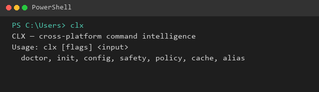

---

## How it works (pipeline)

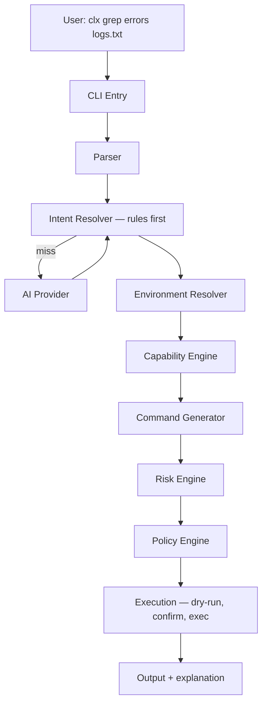

**Example flow**

```text
Input:  clx grep errors logs.txt
  Parser    → shell command detected
  Intent    → search_text_in_file { pattern: "errors", file: "logs.txt" }
  Environment → { os: windows, shell: powershell, tools: [...] }
  Generator → Select-String errors logs.txt
  Risk      → low
  Policy    → allowed
  Execution → confirm (unless -y / policy allows)
```

Every command passes **Generate → Risk → Policy → Dry-run → Confirm → Exec**. The executor uses argv-only execution; user/AI strings are never passed to `powershell -Command` or `cmd /c` as raw interpolated input.

---

## Safety model

**Risk levels**

| Level | Examples |
|-------|----------|
| Low | `ls`, `grep`, `cat`, `git status` |
| Medium | installs, `git push`, `docker run` |
| High | recursive delete, format, shutdown |

**Safety presets** (default: `medium`)

| Mode | Low | Medium | High |
|------|-----|--------|------|
| low | run | run | confirm |
| medium | run | explain + confirm | explain + confirm |
| high | explain + confirm | explain + preview + confirm | explain + preview + confirm |

**Policy** (`~/.clx/policies/policy.yaml`): block list always enforced; `access_level` (`safe` / `moderate` / `full`); allow list only when `safety.mode=high`.

**Useful flags**

| Flag | Purpose |
|------|---------|
| `--explain` | Show intent + translation without executing |
| `--dry-run` | Preview what would run |
| `-y` / `--yes` | Skip confirmation when policy allows |

---

## What CLX is **not** (v1)

- Not an autonomous coding agent or multi-step planner (`clxmax` targets that in v2).
- Not a full repo or IDE assistant.
- Not a plugin marketplace (yet).
- Not a long-term knowledge base, vector store, or RAG index.
- Not shell auto-exec from hooks — hooks call `clx --explain` only; you run the final command yourself.

**Focus:** trustable cross-platform command abstraction — fast, reliable, safe, portable.

---

## Cross-platform demo — same input, different native command

All demos below use **rule-based** resolution (`Source: Rule`) — no AI provider required.

| Input | Windows PowerShell | Windows CMD | Linux (Alpine) |
|-------|-------------------|-------------|----------------|
| `clx --explain grep errors logs.txt` | `Select-String errors logs.txt` | `findstr errors logs.txt` | `grep errors logs.txt` |
| `clx --explain ls .` | `Get-ChildItem .` | `dir .` | `ls -la .` |
| `clx --explain find all files modified today` | PowerShell `Get-ChildItem` pipeline | (shell-specific) | `find . -type f -mtime 0` |
| `clx --dry-run pwd` | `Get-Location` | (CMD-native) | `pwd` |
| `clx --explain what is my ip` | `ipconfig` | `ipconfig` | no strategy in minimal Alpine |

CLX picks the strategy for the **detected shell** (`clx doctor` writes `~/.clx/system_profile.json`). Running from `C:\Users` in PowerShell vs CMD changes the generated command for the same phrase.

**macOS:** supported by the architecture (Bash/Zsh strategies) but not captured on this machine.

---

## Management commands — PowerShell and CMD

All captures use `clx` on PATH from `C:\Users`. Rendered PNGs are generated from real terminal output unless noted.

### `clx doctor`

| PowerShell | Command Prompt |
|------------|----------------|
| 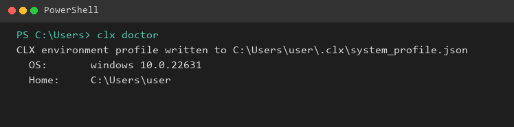 | 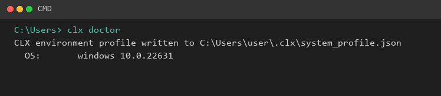 |

### `clx config`

| | PowerShell | Command Prompt |
|---|------------|----------------|
| Help | 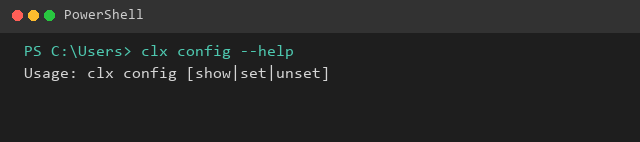 | 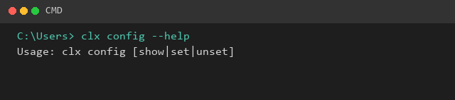 |
| Show | 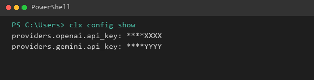 | 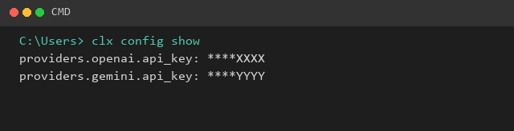 |

### `clx safety show`

| PowerShell | Command Prompt |
|------------|----------------|
| 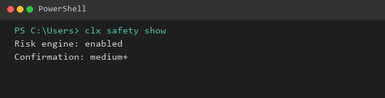 | 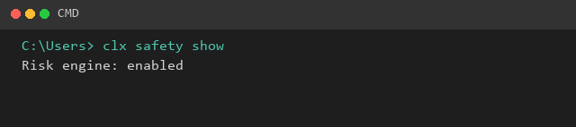 |

### `clx policy show`

| PowerShell | Command Prompt |
|------------|----------------|
| 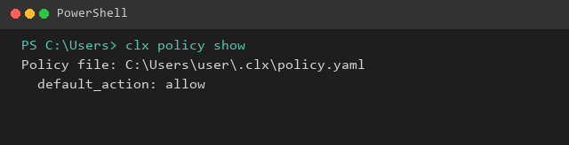 | 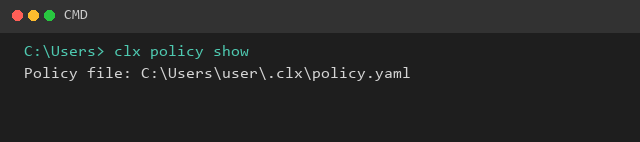 |

### `clx cache status`

| PowerShell | Command Prompt |
|------------|----------------|
| 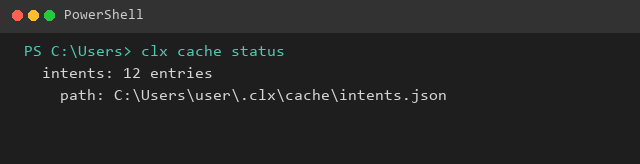 | 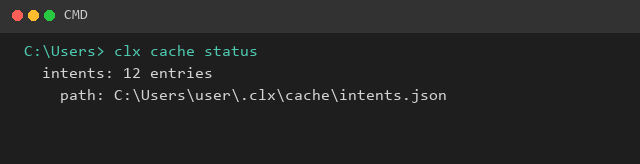 |

### `clx init --help`

| PowerShell | Command Prompt |
|------------|----------------|
| 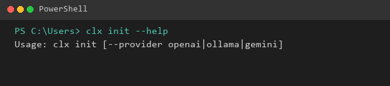 | 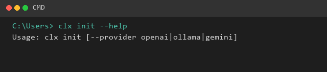 |

### Bare `clx` help — Command Prompt


---

## Translation examples — PowerShell vs CMD

Same input from `C:\Users`; CLX targets the **detected shell**.

### Git, networking, Docker

| Command | PowerShell | Command Prompt |
|---------|------------|----------------|
| `clx --explain git status` | 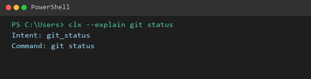 | 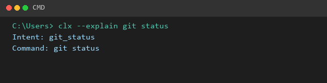 |
| `clx --explain ping google.com` | 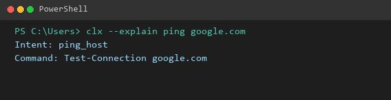 | 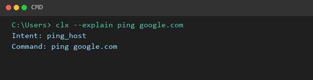 |
| `clx --explain docker ps` | 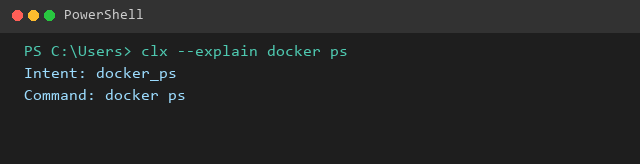 | 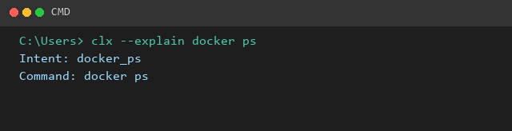 |

### Filesystem and paths

| Command | PowerShell | Command Prompt |
|---------|------------|----------------|
| `clx --version` | 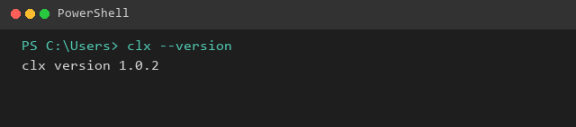 | 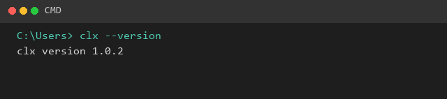 |
| `clx --explain grep errors logs.txt` | 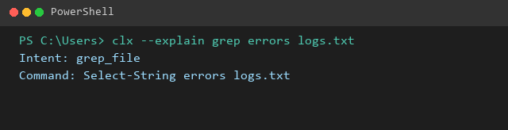 | 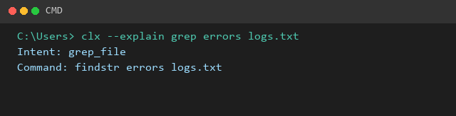 |
| `clx --explain ls .` | 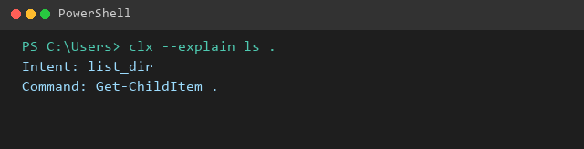 | 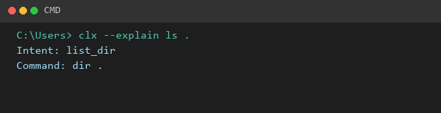 |
| `clx --explain mkdir demo-folder` | 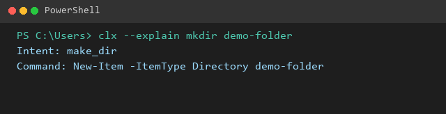 | 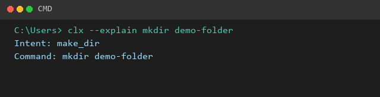 |
| `clx --explain find all files modified today` | 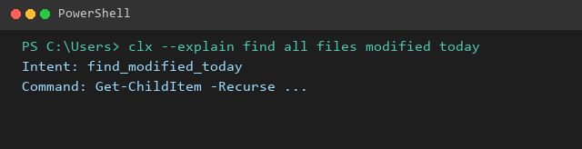 | 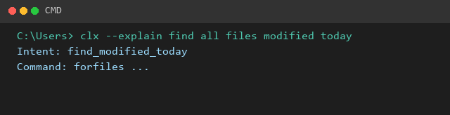 |
| `clx --explain what is my ip` | 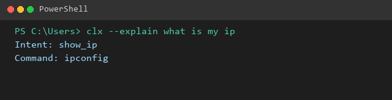 | 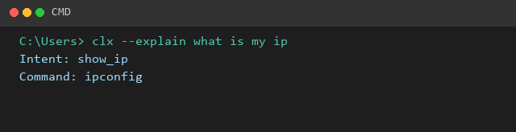 |
| `clx --dry-run pwd` | 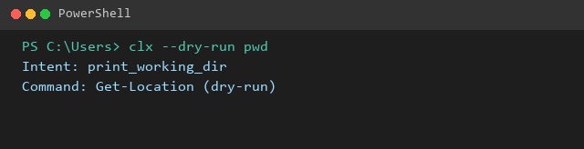 | 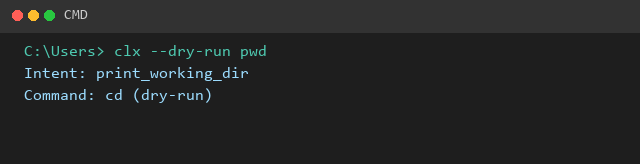 |

**Takeaway:** PowerShell gets cmdlets such as `Select-String` and `Get-ChildItem`; CMD gets `findstr`, `dir`, `mkdir`, and similar — from the same CLX phrase.

---

## Linux — Docker (Alpine)

Same CLI as Windows: run **`clx`**, not a separate binary name. Captures use Alpine with `clx` on `PATH` (symlink to a cross-compiled Linux build from this repo). Each `docker run` is ephemeral, so you may see `CLX: first-run setup complete (~/.clx/)` once per invocation.

### Version

```text
root@alpine:/workspace# clx --version
CLX: first-run setup complete (~/.clx/)
clx version dev (commit unknown, built unknown, go go1.26.3)
```

### Environment detection

```text
root@alpine:/workspace# clx doctor
CLX: first-run setup complete (~/.clx/)
CLX environment profile written to /root/.clx/system_profile.json

  OS:       linux 3.23.4
  Shell:    unknown
  Terminal: unknown
  Tools found: 4 (grep, netstat, ping, wget)
  Home:     /root
  Workspace: /workspace
```

### Explain — grep

```text
root@alpine:/workspace# clx --explain grep errors logs.txt
CLX: first-run setup complete (~/.clx/)
Intent:      search_text_in_file
Params:      file="logs.txt", pattern="errors"
Source:      Rule
Command:     grep errors logs.txt
Explanation: Search for text inside a file
Risk:        low (read-only or safe seed command)
(explain-only — command not executed)
```

### Explain — find files modified today

```text
root@alpine:/workspace# clx --explain find all files modified today
CLX: first-run setup complete (~/.clx/)
Intent:      find_modified_today
Source:      Rule
Command:     find . -type f -mtime 0
Explanation: Run command for intent find_modified_today
Risk:        low (read-only or safe seed command)
(explain-only — command not executed)
```

### Explain — list directory

```text
root@alpine:/workspace# clx --explain ls .
CLX: first-run setup complete (~/.clx/)
Intent:      list_dir
Params:      path="."
Source:      Rule
Command:     ls -la .
Explanation: List directory contents (ls/ll/dir)
Risk:        low (read-only or safe seed command)
(explain-only — command not executed)
```

### Explain — what is my ip

On Windows, the same phrase resolves to `ipconfig`. In minimal Alpine, the intent matches but no Linux strategy is defined for this environment:

```text
root@alpine:/workspace# clx --explain what is my ip
CLX: first-run setup complete (~/.clx/)
translate: no strategy for environment: intent "show_ip_addresses"
```

### Dry-run — pwd

```text
root@alpine:/workspace# clx --dry-run pwd
CLX: first-run setup complete (~/.clx/)
Intent:      current_dir
Source:      Rule
Command:     pwd
Explanation: Print current working directory
Risk:        low (read-only or safe seed command)
dry-run: would execute: pwd
```

---

## AI generation (not shown in live captures)

Live demos intentionally use **rules only** (no Ollama/OpenAI in the container). With a configured provider, natural-language requests can hit **AI** or **cache**; see [generation-test-report.md](development/generation-test-report.md) for a 40-case matrix (95% pass after rule/prompt improvements).

Example NL flows validated on Windows + OpenAI:

- `show me the 10 largest files in this folder` → `Get-ChildItem … | Sort-Object Length -Descending | Select-Object -First 10`
- `kill the process listening on port 8080` → `netstat` + `Stop-Process` chain

---

## Status — what ships in v1

| Area | Status |
|------|--------|
| **clx** | v1.0.0 — rules-first pipeline, AI fallback (Ollama, OpenAI, Gemini), risk/policy, aliases, `clx init` / `clx doctor` / `clx config` |
| **clxmax** | Phase 5 stub (`clxmax --version` only) — multi-step planning in v2 |
| **Install** | Build from source (`make build` / `make install`) or user PATH install; no brew/winget yet |

**CLI subcommands:** `doctor`, `init`, `config`, `safety`, `policy`, `alias`, `cache` — run `clx <cmd> help` for each.

---

## Capture methodology

| Platform | How | CWD / binary |
|----------|-----|----------------|
| Windows PowerShell | Real `clx` output → PNG via `scripts/render-terminal-png.py` | `C:\Users`, `clx` on PATH |
| Windows CMD | Real `clx` output → PNG | `C:\Users`, `clx` on PATH |
| Linux | Real `docker run` output → markdown code blocks | Alpine, `clx` on PATH (`/usr/local/bin/clx`) |

Raw capture text: `doc/capture/{powershell,cmd,linux}/*.txt`

**Linux Docker setup (for reproducing captures):** cross-compile `bin/clx-linux`, mount `bin/` read-only, symlink to `clx` inside the container:

```bash
docker run --rm -v "$(pwd)/bin:/app:ro" -w /workspace alpine \
  sh -c 'ln -sf /app/clx-linux /usr/local/bin/clx && clx --version'
```

**Image paths:** Markdown links use `./images/<file>.png` relative to this file. Hero help screenshot: `./images/clx-help-powershell.png` (real Windows Terminal capture).

---

## Further reading

- [README.md](../README.md) — quickstart and configuration
- [architecture.md](development/architecture.md) — full V1 architecture
- [generation-test-report.md](development/generation-test-report.md) — command-generation test matrix
- [provider-config.md](provider-config.md) — AI provider setup
